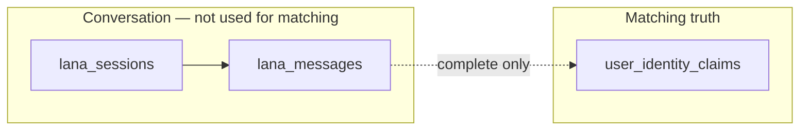

# TagAlng — Lana (team overview)

**Share this doc** with engineering, product, and frontend.  
**For team/manager summary (easy wording + examples):** [`LANA_WHAT_WE_BUILT.md`](LANA_WHAT_WE_BUILT.md)  
**Environment:** tagalng-dev · **Last updated:** June 2026 · **Worker version:** 0.5.0

---

## What Lana is

**Lana** is TagAlng’s conversational agent on **Identity × Vicinity × Activity**:

- **Identity** — learns who you are in your own words → structured **claims** + **embeddings**
- **Vicinity** — knows your **home block** and nearby neighbors/events
- **Activity** — helps you **host an event** in natural language (separate session type)

Lana is **not** a generic chatbot. She is plumbing: extract, match, assist — **never** invent events or message people for the user.

---

## Infrastructure (today)

| Layer | What |
|-------|------|
| **Runtime** | Cloud Run `tagalng-lana-worker` (FastAPI, `us-east1`) |
| **URL (dev)** | `https://tagalng-lana-worker-s5gmxb6whq-ue.a.run.app` |
| **Orchestrator (v0.4)** | Vertex **Claude Haiku 4.5** router + **Sonnet 4.6** synthesizer (R/A/T/C per turn) |
| **Legacy / extract** | Vertex Gemini Flash (`gemini-2.5-flash`) — complete/extract when orchestrator off |
| **Embeddings** | Vertex `text-embedding-005` (768 dims) |
| **Database** | Supabase Postgres — sessions, messages, claims, pgvector |
| **Auth** | Supabase user JWT on every request; worker uses **service role** for writes |
| **Code** | `services/lana-worker/` · deploy: `./scripts/deploy-lana-worker.sh` |

**Prerequisites for any Lana call:** user signed in + `assign_home_block` completed.

**Orchestrator:** enabled when `LANA_ORCHESTRATOR=auto` (default) and `GCP_VERTEX_PROJECT` is set. Enable Claude models in Vertex Model Garden. Set `LANA_ORCHESTRATOR=legacy` to force Gemini-only turns.

---

## Agent orchestrator (v0.4 · Option A)

Per-turn pipeline (see `docs/LANA_AGENT_ARCHITECTURE_v1.md`, `docs/LANA_TOOL_ROUTING_v1.md`):

```
User message
  → input rails (PII scrub + safety keywords)
  → Haiku router (intent, confidence, R/A/T/C, tool pick)
  → tool execution (capture_inquiry, update_event_draft, flag_sensitive, …)
  → Sonnet or Haiku synthesizer (Lana voice + ui + event_draft)
  → output check (refusal-without-capture repair)
  → lana_messages + lana_audit_log + inquiry_signals (if capture)
```

| Outcome | Meaning |
|---------|---------|
| **R** | Conversational reply only |
| **A** | One clarifying question (missing slots) |
| **T** | Tool called, then reply with result |
| **C** | Out-of-scope → `capture_inquiry` + warm bridge |

**Memory (MemGPT two-tier · v0.5.1):**

| Tier | What |
|------|------|
| **Core block** | Always in prompt — user, block, tiers, session state/goal, last topic, event draft, pattern hints (session 3+). Persisted on `lana_sessions.core_block`; synth writes `core_patch` each turn. |
| **Archival** | pgvector on `user_identity_claims`, `inquiry_signals`, `lana_messages`, `neighbor_facts`, `block_context`. **Pre-turn prefetch** (self + neighbors) + explicit **`recall`** tool. |

Migration: `20260614120000_lana_memgpt_memory.sql` · RPC: `lana_recall_memories` (service role).

Last 6 turns also in prompt (working memory).

**On complete (orchestrator on):** Claude Sonnet extract → claims or final event draft; then `create_event` if `publish: true`. Embeddings stay `text-embedding-005` (Gemini).

**Social graph tools (v0.5):** `send_nudge`, `propose_intro`, `propose_cohost`, `update_relationship_tier` (event-driven). Migration `20260613120000_social_graph_lana_tools.sql`.

---

## Two session types

| Purpose | User flow | On **complete** |
|---------|-----------|-----------------|
| `profile_intake` | Signup chat — “tell me your story” | → **`user_identity_claims`** + embeddings |
| `event_draft` | Host chat — “Sunday brunch for new moms…” | → **`event_draft`** JSON; optional **`create_event`** if `publish: true` |

---

## How Lana builds identity (claims + embeddings)

### The core idea

**Chat is for UX. Claims are for truth.**

During conversation Lana only talks and highlights phrases. She does **not** write the profile row-by-row. On **complete**, a second AI pass reads the **full transcript** and produces structured identity threads.

### Phase 1 — Conversation (each turn)

```
User message
    ↓
Worker loads context (see below) + full chat history
    ↓
Vertex Gemini — "Lana turn" prompt
    ↓
Reply + ui.highlights + status (continue | ready_to_complete)
    ↓
Save to lana_messages + update lana_sessions.context
```

**Nothing is written to `user_identity_claims` yet.**

### Phase 2 — Complete (profile intake)

```
All lana_messages (full transcript)
    ↓
Vertex Gemini — "extract" prompt
    ↓
claims[] + mapped_summary + spans
    ↓
For each claim:
  · INSERT user_identity_claims (concept, label, bucket, source_quote, disclosure, synonyms)
  · EMBED text-embedding-005 on "{concept}: {label}" → vector(768) in pgvector
    ↓
Session status = completed; summary stored in session.context
```

### One claim row (example)

User said: *“Italian mom, two toddlers, new to Lake Nona.”*

| Column | Example | Role |
|--------|---------|------|
| `concept` | `italian_heritage` | Stable id for overlap |
| `label` | `Italian` | Profile card title |
| `synonyms` | `["Italo-American"]` | “≈” chips |
| `bucket` | `heritage` | UI color (7 buckets) |
| `source_quote` | `"Italian mom"` | “From …” line |
| `disclosure` | `public` / `mutual` / `private` | Who can see it |
| `embedding` | vector(768) | Semantic peer match |

On complete, active claims are **replaced** (delete non-dismissed rows, insert new set). Chat history is **kept** for audit/resume.

### Why embeddings?

| Use | How |
|-----|-----|
| **Peer map** | RPC `match_peers_by_claim_vectors` — cosine similarity of **public** claims on same block |
| **Lana context** | Worker injects top similar neighbors into each turn’s prompt |
| **Events (today)** | Affinity uses `events.cohort_tags` + concept overlap — **not** claim embeddings yet |

Embeddings capture **meaning** (“Sicilian” ≈ “Italian heritage”), not only exact `concept` slug match.

---

## How chat history is saved



### `lana_sessions`

| Field | Purpose |
|-------|---------|
| `purpose` | `profile_intake` or `event_draft` |
| `status` | `active` / `completed` / `abandoned` |
| `context` | JSON: `topics_covered`, `mapped_summary`, `spans`, `event_draft`, `last_status` |
| `user_id` | Owner |

One **active** session per purpose per user (starting a new one abandons the old).

### `lana_messages`

| Field | Purpose |
|-------|---------|
| `role` | `user` or `assistant` |
| `content` | Message text |
| `metadata` | Assistant: `{ status, ui: { highlights, bucket, focus_phrase } }` |

**RLS:** users can **read** own sessions/messages; only **lana-worker** **writes** (service role).

---

## What context Lana gets every turn

This is **retrieve → augment → generate** (light agent context, not a document RAG product):

```
┌──────────────────────────────────────────────────┐
│ System prompts (product + persona + JSON schema) │
├──────────────────────────────────────────────────┤
│ From database (reloaded each turn):              │
│   · nickname, home block, ZIP                    │
│   · existing claims (if re-intake)               │
│   · block member count                           │
│   · upcoming open events on cluster (max 3)      │
│   · neighbor public claim labels + shared count  │
│   · vector-similar peers on same block           │
│   · event purpose chip ids (event_draft only)    │
├──────────────────────────────────────────────────┤
│ Full session transcript (lana_messages)          │
├──────────────────────────────────────────────────┤
│ User's new message                               │
└──────────────────────────────────────────────────┘
                    ↓
            Vertex Gemini Flash
```

**DB RPCs used for retrieval:**

- `get_lana_block_context_for_user` — neighbors + events (service role)
- `match_peers_by_claim_vectors_for_user` — vector peer hints (service role)

---

## Why we built it this way

| Decision | Reason |
|----------|--------|
| **Chat ≠ matching truth** | Raw messages are noisy; claims are structured, permissioned, queryable with RLS |
| **Extract on complete** | One pass over full story → stable `concept` slugs; turn model stays conversational |
| **Claims as rows, not columns** | New facets (“pickleball”, “postpartum”) = new rows, no schema migration per user |
| **Two Gemini calls** | Different jobs: dialogue (fast, every turn) vs extract (structured, once) |
| **pgvector in Postgres** | Same plane as events, blocks, RLS — no separate vector DB in v0.1 |
| **Block-scoped retrieval** | Lana feels local (“others on your block…”), not city-wide generic AI |

**Product guardrails (enforced in prompts + extract rules):**

- Never store race, exact age, sex, or street address  
- Faith / sobriety / LGBTQ+ → `disclosure: mutual` when extracted  
- Lana does not create events without host **publish** (`event_draft` complete)

---

## Event draft (host flow)

Same worker, same session/message/complete pattern:

| Per turn | Returns `event_draft` + `ui.highlights` with event buckets: `time`, `venue`, `audience`, `activity`, `constraint`, `capacity`, `purpose` |
| Complete | Final extract → `event_draft`; if `publish: true` → calls `create_event` with Purpose tags (`cohort_tags`) |

Purpose chips: RPC `get_event_purposes()` (10 ids, e.g. `coffee_stroller`, `postpartum_support`).

---

## HTTP API (summary)

**Base:** `{{lana_worker_url}}` · **Auth:** `Authorization: Bearer <supabase_access_token>`

| Method | Path | Body |
|--------|------|------|
| `GET` | `/health` | — |
| `POST` | `/lana/sessions` | `{ "purpose": "profile_intake" \| "event_draft" }` |
| `POST` | `/lana/sessions/{id}/messages` | `{ "message": "..." }` |
| `POST` | `/lana/sessions/{id}/complete` | `{ "force": false, "publish": true }` |
| `GET` | `/lana/sessions/{id}` | Resume transcript |

**Profile complete** → read claims: `get_my_identity_claims` or `get_my_profile_dashboard` (Supabase RPC).

**Signup order:** OTP → `assign_home_block` → Lana → profile UI.

---

## Is this the right approach?

### Keep (v0.1–v0.2)

- Conversational intake + structured claims + block-scoped embeddings  
- Chat history separate from matching truth  
- Light retrieval (block + neighbors + vectors) each turn  
- Cloud Run worker + Supabase source of truth  

### Revisit later (not blockers)

| Limitation | Future option |
|------------|---------------|
| Full transcript every turn (token cost) | Session summary after N turns |
| Replace-all claims on re-complete | Merge by `concept`, keep dismissed rows |
| Extract only at complete | Optional mid-session preview extract |
| No event embeddings | `events.embedding` for semantic affinity |
| Context reload every turn | Short TTL cache per session |

### Do not change (CTO rules)

- Chat messages as matching source of truth  
- AI-generated events without host publish  
- Street-level PII in claims  
- Heavy multi-agent stack before core loop is stable in prod  

**Recommendation:** Stay on this architecture. Next wins: claim merge on re-intake, event embeddings, metrics on extract quality.

---

## Key tables & migrations

| Table / RPC | Role |
|-------------|------|
| `lana_sessions` | Session metadata + `context` JSON |
| `lana_messages` | Chat transcript |
| `user_identity_claims` | Identity truth + embeddings |
| `get_lana_block_context_for_user` | Block retrieval for worker |
| `match_peers_by_claim_vectors` | Peer map (PWA) |
| `get_event_purposes` | Host Purpose chips |
| `get_my_profile_dashboard` | Profile tab one-shot load |

Migrations: `20260603120000` (sessions), `20260604120000` (claim UI cols), `20260608120000` (block context), `20260609120000` (vector peers), `20260611120000` (event purposes), `20260611130000` (RLS fix for create_event).

---

## Test in Postman

1. Import `docs/postman/TagAlng-Full-Flow.postman_collection.json` + `TagAlng-tagalng-dev.postman_environment.json`
2. Set `anon_key` from Supabase dashboard
3. **Profile:** folders **A → B → C → D**
4. **Host event:** folders **A → B → C → F**

Test phone: `+15550000000` · OTP: `000000`

---

## Repo map

```
services/lana-worker/
  app/main.py           — HTTP routes
  app/vertex_lana.py    — profile chat turns
  app/vertex_extract.py — profile complete → claims
  app/vertex_event.py   — event chat turns
  app/context.py        — retrieval + prompt formatting
  prompts/              — product + persona (versioned in git)
```
