# Lana guest signup + post-verify capabilities — frontend handoff

**Audience:** mobile / PWA frontend team  
**Backend:** `tagalng-dev` · Lana worker on Cloud Run  
**Last updated:** June 2026

This doc describes the **new Lana-first signup flow** (anonymous → in-chat profile → joint moment → phone verify → complete) and what users can do **before vs after** phone verification. It also covers **returning-user login** and in-chat tools for **finding similar neighbors** and **hosting activities**.

**Related docs**

| Doc | Use |
|-----|-----|
| [`LANA_API.md`](./LANA_API.md) | Full Lana API (messages, complete, event draft) |
| [`GUEST_PWA_HANDOFF.md`](./GUEST_PWA_HANDOFF.md) | Screen → API map + demo PWA (`/lana/meet`) |
| [`FRONTEND_API.md`](./FRONTEND_API.md) | Returning-user OTP login (folder B) |
| Postman `TagAlng-Guest-Onboarding-Full.postman_collection.json` | E2E guest flow (steps 1–13) |
| Postman `TagAlng-Full-Flow.postman_collection.json` | Returning user + block + Lana |

**Base URLs (dev)**

| System | URL |
|--------|-----|
| Supabase | `https://rjlcyvwogmfmngemhbmn.supabase.co` |
| Lana worker | `https://tagalng-lana-worker-s5gmxb6whq-ue.a.run.app` |

---

## Two entry paths

```mermaid
flowchart TD
  subgraph new [New user — Lana signup]
    A[Meet Lana] --> B[signInAnonymously]
    B --> C[POST /lana/sessions]
    C --> D[Chat: profile + joint moment]
    D --> E[Phone OTP phone_change]
    E --> F[Post-verify chat]
    F --> G[POST complete]
    G --> H[assign_home_block]
    H --> I[send_joint_moment_intro]
  end

  subgraph returning [Returning user — already has account]
    R1[signInWithOtp] --> R2[verifyOtp type sms]
    R2 --> R3[Existing user_id + session]
    R3 --> R4[Lana / RPCs / events]
  end
```



| Path | When | Auth APIs |
|------|------|-----------|
| **Guest signup** | First time, “Meet Lana” | `signInAnonymously()` → later `updateUser({ phone })` → `verifyOtp({ type: 'phone_change' })` |
| **Returning login** | Account already exists | `signInWithOtp({ phone })` → `verifyOtp({ type: 'sms' })` |

**Critical:** Guest signup must use `phone_change` so the **same `user_id`** is kept as the Lana session. Returning login must use `sms`. Mixing them breaks the session (`session_not_found` on Lana).

---

## Auth states and what is allowed

The app should treat the user as moving through these states. Lana responses expose the current state on every message turn.

| State | How you know | Allowed | Blocked |
|-------|--------------|---------|---------|
| **Anonymous visitor** | `is_anonymous: true`, `phone_verified: false` | Lana profile chat, joint moment card, intro name | Peer find, host activity, neighbor comms, publish events |
| **Awaiting phone** | `onboarding_step: await_phone`, `requires_phone_verification: true` | Show phone + OTP UI | Everything that needs a verified neighbor identity |
| **Phone verified (post-verify)** | `phone_verified: true`, `onboarding_step: post_verify` | Finish profile chat, **find people like me**, start hosting draft | Full peer comms until profile saved + home block assigned |
| **Onboarded neighbor** | `phone_verified: true`, `home_block_assigned: true`, profile complete | All block features: peers, RTJ, host/publish, intros | — |

**Rule of thumb for FE gating**

- **Before OTP:** only onboarding UI (chat, joint moment, phone screen). Ignore “find neighbors” / “host” intents in product UI — Lana will keep the user on signup.
- **After OTP:** user is **authenticated** (no longer anonymous). Enable post-verify chat, Complete, block assignment, and in-chat peer/host tools.
- **After Complete + `assign_home_block`:** peer matches and hosting work best (claims + embeddings saved, block set).

---

## Guest signup flow (step by step)

Everything through phone verify happens **inside one Lana chat session**. The frontend drives screens from `onboarding_step` on each API response.

### 0. Prerequisites (Supabase Dashboard)

- Auth → **Anonymous sign-ins** ON  
- Auth → **Manual linking** ON  
- Auth → Phone provider ON + dev test numbers (e.g. `+15550999012` / OTP `000000`)

### 1. Anonymous sign-in

```ts
const { data, error } = await supabase.auth.signInAnonymously();
const accessToken = data.session!.access_token;
// user.is_anonymous === true
```

REST equivalent: `POST /auth/v1/signup` with anon key (see Postman step 1).

### 2. Start Lana session

```http
POST /lana/sessions
Authorization: Bearer <anonymous access_token>
Content-Type: application/json

{ "purpose": "profile_intake" }
```

**Response highlights**

```json
{
  "session_id": "uuid",
  "assistant_message": "So — who are you, right now? ...",
  "is_anonymous": true,
  "phone_verified": false,
  "home_block_assigned": false,
  "onboarding_step": "early_chat",
  "requires_phone_verification": false
}
```

`profile_intake` does **not** require a home block yet (anonymous guests can start chat).

### 3. Chat turns

```http
POST /lana/sessions/{session_id}/messages
Authorization: Bearer <access_token>

{ "message": "I'm a Latino mom in Lake Nona, new here about 3 months." }
```

Read these fields on **every** message response:

| Field | Type | FE use |
|-------|------|--------|
| `assistant_message` | string | Chat bubble |
| `onboarding_step` | string | Route UI (see table below) |
| `requires_phone_verification` | boolean | Show phone screen when `true` |
| `joint_moment` | object \| null | Purple intro card (Maria) |
| `phone_verified` | boolean | From auth; true after OTP |
| `home_block_assigned` | boolean | User has `home_block_id` |
| `ready_to_complete` | boolean | Show “That’s me” after post-verify |
| `peer_matches` | array | Populated when user asks to find similar neighbors (post-verify only) |
| `ui.bucket`, `ui.highlights` | — | Profile intake highlighting (same as [`LANA_API.md`](./LANA_API.md)) |

#### `onboarding_step` values

| Step | Meaning | FE action |
|------|---------|-----------|
| `early_chat` | Collecting life stage + heritage | Chat composer only |
| `offered_intro` | Joint moment offered (yes/no) | Show **joint moment card** + optional Yes/No |
| `awaiting_intro_name` | Need name for intro | Chat — “What should Maria call you?” |
| `await_phone` | OTP required before intro | Navigate to **phone verification** screen |
| `post_verify` | Phone done; finish kids/interests | Chat → Complete button |
| `intro_declined` | User declined intro | Normal profile chat |

#### Example conversation

| Turn | Who | Message |
|------|-----|---------|
| 0 | Lana | So — who are you, right now? |
| 1 | User | I'm a Latino mom in Lake Nona, new here about 3 months. |
| 2 | Lana | Maria is looking for Brazilian moms too. Want an intro? |
| 3 | User | Yes |
| 4 | Lana | What should Maria call you? |
| 5 | User | Linda |
| 6 | Lana | Perfect, Linda! Verify your phone — use the button below. |
| — | **FE** | Phone screen (`requires_phone_verification: true`) |
| 7 | User | *(after OTP)* ok |
| 8 | Lana | You're verified! How many kids, and what ages? |
| 9–11 | … | Interests, wrap-up |
| — | **FE** | Complete → block → intro |

### 4. Joint moment card

When `joint_moment` is present:

```json
{
  "joint_moment": {
    "joint_moment_id": "uuid",
    "status": "offered",
    "candidate": {
      "user_id": "uuid",
      "nickname": "Maria",
      "avatar_url": null
    },
    "lana_copy": "Maria told me she's looking for Brazilian moms...",
    "match_reason": "shared heritage + life stage",
    "is_demo": true
  }
}
```

- `is_demo: true` — no real peer match yet (common early in chat before claims exist). Still show the card; backend may upgrade to a real match later.
- User taps **Yes** → send message `"Yes"` (or typed yes). Backend calls `respond_joint_moment` internally.
- User taps **No** → send `"No"` → `onboarding_step` becomes `intro_declined`.

Store `joint_moment_id` — needed for step 7.

### 5. Phone verification (guest — keep same user_id)

User must still be signed in as the **anonymous** user when linking phone.

```ts
// 1. Link phone (Supabase sends OTP automatically)
await supabase.auth.updateUser({ phone: '+15550999012' });

// 2. Verify — MUST be phone_change, NOT sms
const { data, error } = await supabase.auth.verifyOtp({
  phone: '+15550999012',
  token: '000000',
  type: 'phone_change',
});

// data.user.is_anonymous === false
// data.session.access_token — use for all subsequent Lana calls (same user_id)
```

**Do not** call `POST /auth/v1/otp` during guest onboarding — that is **sign-in** and can create a different user.

After verify, send any message to the **same** `lana_session_id`. Lana detects `phone_verified` and advances to `post_verify`.

### 6. Complete profile

When `ready_to_complete: true` (or user taps “That’s me”):

```http
POST /lana/sessions/{session_id}/complete
Authorization: Bearer <verified access_token>

{ "force": false }
```

Guest flow often needs `{ "force": true }` if Lana has not yet flipped `ready_to_complete`. Response includes `claims[]` saved to `user_identity_claims` — see [`LANA_API.md`](./LANA_API.md#3-complete-profile).

**Important:** Guest intake continues on the same session even after `is_anonymous` becomes `false`. Keep using the same `session_id` and bearer token.

### 7. Assign home block

```ts
await supabase.rpc('assign_home_block', {
  p_lat: 28.3647,
  p_lng: -81.2568,
});
// or p_block_id from get_blocks_near_zip
```

After this, `home_block_assigned: true` on Lana responses.

### 8. Send joint moment intro

```ts
await supabase.rpc('send_joint_moment_intro', {
  p_joint_moment_id: jointMomentId, // from joint_moment.joint_moment_id
  p_opener_text: 'Hi Maria — Lana thought we should meet!',
});
```

Returns `{ status: 'intro_sent', nudge_id: '...' }`.

---

## Returning user login (account already exists)

Do **not** use anonymous signup. Use standard phone OTP login:

```ts
await supabase.auth.signInWithOtp({ phone: '+15550000000' });

await supabase.auth.verifyOtp({
  phone: '+15550000000',
  token: '000000',
  type: 'sms',  // login — NOT phone_change
});
```

Postman: folder **B** in `TagAlng-Full-Flow.postman_collection.json`.

Then:

1. `get_my_profile` — check `home_block_id`, `phone_verified_at`
2. `assign_home_block` if needed
3. `POST /lana/sessions` with verified token — normal `profile_intake` or `event_draft` (not guest opening)

Returning users skip `onboarding_step` guest states unless they start a fresh guest session while anonymous.

---

## In-chat capabilities (post-verify tools)

After phone verification, Lana handles certain intents **inside chat** when `onboarding_step === 'post_verify'`. These do **not** run during signup (`early_chat`, joint moment, name, phone steps).

### Find similar neighbors (“find people like me”)

**When:** `phone_verified: true` + `onboarding_step: post_verify`  
**Trigger:** User messages like “find people like me”, “who else on the block is similar”, “find neighbors like me”

**Backend:** Calls Supabase RPC `match_peers_by_claim_vectors` with the user JWT.

**Response**

```json
{
  "assistant_message": "I found 2 neighbors on your block:\n• Maria — Brazilian moms (87%)\n• Beatriz — weekend activities (72%)\nWant me to introduce you to any of them?",
  "onboarding_step": "post_verify",
  "phone_verified": true,
  "peer_matches": [
    {
      "peer_user_id": "uuid",
      "nickname": "Maria",
      "avatar_url": null,
      "similarity_score": 0.87,
      "matching_peer_label": "Brazilian moms",
      "matching_peer_concept": "latino_heritage",
      "has_exact_concept_match": true
    }
  ]
}
```

**FE suggestions**

- Render `peer_matches` as peer chips/cards below Lana’s message.
- If `peer_matches` is empty, show Lana’s text (usually prompts user to tap Complete so claims are saved).
- Requires `home_block_id` for best results; if missing, Lana asks user to finish onboarding / assign block.

### Host an activity

**When:** Same as peer find (post-verify only)  
**Trigger:** “host an activity”, “plan a brunch”, “create a meetup”, etc.

**Behavior:** Lana replies with hosting guidance. For full event drafting UI, start a separate session:

```http
POST /lana/sessions
{ "purpose": "event_draft" }
```

`event_draft` requires phone-verified user and **home block** to publish. See [`LANA_API.md` — Event draft](./LANA_API.md#event-draft-host-an-event).

### Capability gating summary

| User says | Signup (unverified) | Post-verify | Verified + block + complete |
|-----------|---------------------|-------------|----------------------------|
| Find people like me | Ignored — stay on onboarding | Lana returns `peer_matches` (may be empty) | Full vector matches |
| Host an activity | Ignored — stay on onboarding | Lana prompts for event details | Can open `event_draft` session + publish |

---

## TypeScript response shape (guest turns)

```ts
type PeerMatchRow = {
  peer_user_id?: string;
  nickname?: string;
  avatar_url?: string;
  similarity_score?: number;
  matching_peer_label?: string;
  matching_peer_concept?: string;
  has_exact_concept_match?: boolean;
};

type JointMoment = {
  joint_moment_id?: string;
  status?: string;
  candidate?: { user_id?: string; nickname?: string; avatar_url?: string };
  lana_copy?: string;
  match_reason?: string;
  is_demo?: boolean;
};

type LanaGuestTurn = {
  session_id: string;
  status: 'continue' | 'ready_to_complete';
  assistant_message: string;
  message_count: number;
  ready_to_complete: boolean;

  // Guest onboarding
  onboarding_step?: string;
  requires_phone_verification?: boolean;
  joint_moment?: JointMoment | null;
  phone_verified?: boolean;
  home_block_assigned?: boolean;
  peer_matches?: PeerMatchRow[];

  // Profile UI (same as signed-in intake)
  ui?: {
    bucket?: string;
    focus_phrase?: string;
    highlights?: { text: string; bucket: string }[];
  };
};
```

---

## Resume mid-flow

```http
GET /lana/sessions/{session_id}
Authorization: Bearer <access_token>
```

Returns `context` (includes `guest_step`, `joint_moment_id`, etc.) and `messages[]`.

Supabase RPCs (read-only): `get_active_lana_session`, `get_lana_session_messages`.

After OTP, always refresh the session token and continue the **same** `session_id`.

---

## Env vars

```bash
NEXT_PUBLIC_SUPABASE_URL=https://rjlcyvwogmfmngemhbmn.supabase.co
NEXT_PUBLIC_SUPABASE_ANON_KEY=<from dashboard>
NEXT_PUBLIC_LANA_WORKER_URL=https://tagalng-lana-worker-s5gmxb6whq-ue.a.run.app
```

---

## FE routing cheat sheet

```
onboarding_step === 'await_phone' OR requires_phone_verification
  → PhoneVerifyScreen

onboarding_step === 'offered_intro' AND joint_moment
  → Chat + JointMomentCard (Yes/No)

onboarding_step === 'post_verify' AND ready_to_complete
  → Chat + CompleteButton

peer_matches.length > 0
  → PeerMatchList below assistant message

phone_verified && !home_block_assigned && user finished complete
  → Location / assign_home_block flow

Returning user (not anonymous)
  → Skip guest steps; use normal Lana + app shell
```

---

## Test checklist

- [ ] Anonymous → Lana session → `onboarding_step: early_chat`
- [ ] Life stage message → joint moment card → `offered_intro`
- [ ] Yes → name → `await_phone` + phone UI
- [ ] `phone_change` OTP → same `user_id` → Lana still accepts messages
- [ ] Post-verify message → kids/interests → Complete → claims saved
- [ ] `assign_home_block` → `home_block_assigned: true`
- [ ] `send_joint_moment_intro` with stored `joint_moment_id`
- [ ] “Find people like me” **during** signup does not show peers
- [ ] “Find people like me” **after** verify returns `peer_matches`
- [ ] Returning user: `signInWithOtp` + `type: sms` logs into existing account

**Postman:** Run `TagAlng-Guest-Onboarding-Full` steps 1–13 in order.  
**Demo PWA:** `apps/admin` → `/lana/meet` (see [`GUEST_PWA_HANDOFF.md`](./GUEST_PWA_HANDOFF.md)).

---

## Common errors

| Error | Cause | Fix |
|-------|-------|-----|
| `session_not_found` on Lana | OTP used `type: sms` during guest flow | Use `phone_change` |
| `invalid_session` | Expired token after OTP | Refresh session; use new `access_token` |
| `home_block_required` | `event_draft` without block | `assign_home_block` first |
| `phone_not_verified` | Publish event before OTP | Complete phone verify |
| Empty `peer_matches` | No claims/embeddings yet | Call `complete` first; ensure block assigned |
