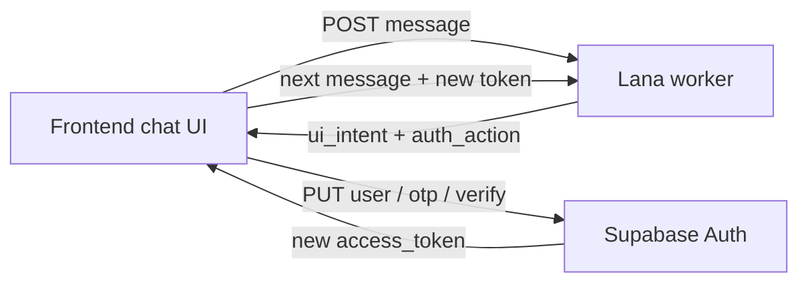

# Lana unified discovery — frontend handoff

**Audience:** mobile / PWA frontend team  
**Backend:** `tagalng-dev` · Lana worker on Cloud Run  
**Status:** v1.1 — unified chat + `ui_intent` + in-chat auth (June 2026)  
**Postman:** `docs/postman/TagAlng-Lana-Unified-Full-E2E.postman_collection.json`  
**Reference FE:** `apps/admin/app/lana/meet/page.tsx` + `apps/admin/lib/demo-user.ts`

This doc describes **exactly what backend shipped** for the new **unified Lana chat** model and how frontend should integrate it — especially the **discovery flow** (find similar neighbors) and **`auth_action`** OTP handoff.

**Related docs**

| Doc | Use |
|-----|-----|
| [`LANA_UNIFIED_ROUTING_FLOW.md`](./LANA_UNIFIED_ROUTING_FLOW.md) | Flow diagram + privacy rules |
| [`LANA_GUEST_SIGNUP_FRONTEND.md`](./LANA_GUEST_SIGNUP_FRONTEND.md) | Legacy guest signup (`profile_intake`) + in-chat login |
| [`GUEST_PWA_HANDOFF.md`](./GUEST_PWA_HANDOFF.md) | Older screen → API map |

**Base URLs (dev)**

| System | URL |
|--------|-----|
| Supabase | `https://rjlcyvwogmfmngemhbmn.supabase.co` |
| Lana worker | `https://tagalng-lana-worker-s5gmxb6whq-ue.a.run.app` |

---

## What changed (read this first)

### Old model (deprecated for new FE work)

- Frontend chose session mode at create: `purpose: "profile_intake"` or `"event_draft"`.
- Whole session stayed in that mode until complete.
- OTP verify was a separate screen; Postman collections mixed Lana + Supabase steps inconsistently.

### New model (what to build against)

- Frontend opens **one chat** — send **empty body** on session create.
- Backend defaults `purpose` to **`"lana"`** and **routes per message** (ZIP → identity → display name → preview → verify gate → full matches).
- Frontend **does not** send `profile_intake` / `event_draft` for the main Meet Lana experience.
- When user needs auth, Lana returns **`ui_intent`** (what input to show) and **`auth_action`** (what Supabase call to make). Frontend must call **Supabase Auth** — Lana never verifies OTP itself.



---

## What backend built (exact scope)

| Area | What shipped |
|------|----------------|
| **DB migration** | `20260618120000_lana_unified_purpose.sql` — adds `'lana'` to `lana_session_purpose` enum |
| **Session default** | `POST /lana/sessions` with `{}` → `purpose: "lana"` |
| **Unified pipeline** | `lana_unified_pipeline.py` — discovery gates (code) + orchestrator (AI) per turn |
| **Discovery routing** | `discovery_route.py` — ZIP → identity → **display name** → preview → verify gate → full |
| **`ui_intent`** | `ui_intent.py` — stable FE signal for phone/OTP/ZIP/name fields (see table below) |
| **In-chat login** | `guest_login.py` — user says "log in" → `await_login_phone` / `await_login_otp` |
| **In-chat signup** | Discovery verify gate → `await_signup_phone` / `await_signup_otp` |
| **Auth handoff** | `auth_action` on responses — FE calls Supabase (see reference impl) |
| **Incremental claims** | Each identity message → background extract → `user_identity_claims` upsert |
| **Nickname** | `"my name is …"` → `users.nickname` sync; discovery asks name if missing |
| **`activity_previews`** | Activity browse returns cards separate from `peer_matches` |
| **Tests** | `tests/test_discovery_route.py`, `tests/test_ui_intent.py`, `tests/test_claims_persist.py` |

**Not in this slice**

- Mid-session switch to `event_draft` host flow inside unified chat (legacy `event_draft` purpose still works separately).
- Backend-side OTP validation — **by design**, auth stays in Supabase.

**Orchestrator:** may be on per env (`LANA_ORCHESTRATOR`); discovery privacy gates (ZIP, phone, OTP) stay **code-first** regardless.

---

## Prerequisites (Supabase Dashboard)

- Auth → **Anonymous sign-ins** ON
- Auth → **Manual linking** ON
- Auth → **Phone** provider ON
- Dev test numbers (optional): e.g. `+15550999012` / OTP `000000`

---

## API contract

### 1. Anonymous sign-in

```ts
const { data } = await supabase.auth.signInAnonymously();
const accessToken = data.session!.access_token;
// user.is_anonymous === true
```

REST: `POST /auth/v1/signup` with anon key, body `{}`.

### 2. Start unified Lana session

```http
POST /lana/sessions
Authorization: Bearer <anonymous access_token>
Content-Type: application/json

{}
```

**Do not send `purpose`** — backend defaults to `"lana"`.

**Response (highlights)**

```json
{
  "session_id": "uuid",
  "purpose": "lana",
  "status": "continue",
  "assistant_message": "Hey — I'm Lana, your block concierge. ...",
  "is_anonymous": true,
  "phone_verified": false,
  "home_block_assigned": false,
  "active_intent": null,
  "routing_phase": "listening",
  "ui_intent": "chat",
  "auth_action": null,
  "peer_matches": [],
  "activity_previews": [],
  "orchestrator": false
}
```

Store `session_id` — all messages use the same session.

### 3. Send messages (every turn)

```http
POST /lana/sessions/{session_id}/messages
Authorization: Bearer <access_token>
Content-Type: application/json

{ "message": "find people like me on the block" }
```

**Response fields frontend must read every turn**

| Field | Type | FE use |
|-------|------|--------|
| `assistant_message` | string | Render Lana bubble |
| `active_intent` | string \| null | e.g. `discovery.find_peers` |
| `routing_phase` | string \| null | Debug / analytics phase (see table below) |
| `ui_intent` | string \| null | **Drive input UI** — phone field, OTP field, ZIP, etc. (see table) |
| `phone_verified` | boolean | **Source of truth** for verified state |
| `home_block_assigned` | boolean | User has `home_block_id` on profile |
| `peer_matches` | array | Preview or full neighbor cards |
| `activity_previews` | array | Activity browse cards (when user asks for events) |
| `auth_action` | object \| null | **When set, call Supabase immediately** (same turn as user message) |
| `login_phone` | string \| null | Phone captured during in-chat login (hint for OTP UI) |
| `requires_login_otp` | boolean | Login OTP step active |
| `routing.tool_called` | string | Debug / analytics |
| `orchestrator` | boolean | Whether AI orchestrator ran this turn |

### `ui_intent` — **primary FE driver** (use this for input chrome)

Read **`ui_intent` every turn** (session create + each message). Switch UI based on it; use `routing_phase` only for debug/analytics.

| `ui_intent` | Show in UI |
|-------------|------------|
| `chat` | Default message composer |
| `collect_zip` | ZIP input (`inputMode=numeric`, max 5 digits) |
| `collect_identity` | Free-text “about you” |
| `collect_display_name` | First-name field — saved to `users.nickname` |
| `collect_phone` | Phone field (`type=tel`) + **Continue** → send as Lana message |
| `collect_otp` | OTP field (6 digits) + **Verify** → send as Lana message, then run `auth_action` |
| `show_peer_preview` | Redacted neighbor cards (`peer_matches`, `preview: true`) |
| `show_activity_preview` | Activity cards (`activity_previews`) |
| `confirm_profile` | “That’s me ✓” / `POST …/complete` when `ready_to_complete` |

**Pairing with `auth_action`:** user can type phone/OTP in chat *or* use dedicated fields — both work. On the turn where Lana parses phone/OTP, check `auth_action` and call Supabase **before** treating auth as done.

```ts
// After every Lana message:
applyTurn(turn); // read ui_intent, peer_matches, routing_phase, etc.
const action = authActionFromTurn(turn);
if (action) {
  const newToken = await handleLanaAuthAction(action);
  // signup: same session_id, new token
  // login: new user_id → start new Lana session (see below)
}
```

TypeScript types: `apps/admin/lib/lana-client.ts` → `LanaUiIntent`, `AuthActionPayload`.

### `routing_phase` values (debug / analytics)

| Phase | Typical `ui_intent` | Meaning |
|-------|---------------------|---------|
| `listening` | `chat` | Opening / no active discovery |
| `need_zip` | `collect_zip` | Need 5-digit US ZIP |
| `need_identity` | `collect_identity` | Need heritage / life stage / what they want |
| `need_display_name` | `collect_display_name` | Need `users.nickname` before preview |
| `preview` | `show_peer_preview` or `show_activity_preview` | Cards shown |
| `gate_verify` / `await_signup_phone` | `collect_phone` | Signup verify gate — need phone |
| `await_signup_otp` | `collect_otp` | Signup — need OTP (`phone_change`) |
| `await_login_phone` | `collect_phone` | In-chat login — need phone |
| `await_login_otp` | `collect_otp` | In-chat login — need OTP (`sms`) |

---

## Discovery flow — conversation script

Example happy path (messages user sends in chat):

| Step | User message | `ui_intent` after | `routing_phase` | Notes |
|------|--------------|-------------------|-----------------|-------|
| 1 | *(session open)* | `chat` | `listening` | Concierge greeting |
| 2 | `find people like me on the block` | `collect_zip` | `need_zip` | `active_intent: discovery.find_peers` |
| 3 | `32827` | `collect_identity` | `need_identity` | `get_blocks_near_zip` → `preview_block_id` |
| 4 | `I'm a Latino mom…` | `collect_display_name` | `need_display_name` | If `users.nickname` empty |
| 5 | `Marina` | `show_peer_preview` | `preview` | 3 redacted `peer_matches` |
| 6 | `show me their names` | `collect_phone` | `await_signup_phone` | Verify gate (anonymous) |
| 7 | `+15550999012` | `collect_otp` | `await_signup_otp` | `auth_action: link_phone_signup` → FE **PUT /user** |
| 8 | `000000` | `collect_otp` | `await_signup_otp` | `auth_action: verify_signup_otp` → FE **POST /verify** `phone_change` |
| 9 | `ok` *(new bearer)* | `show_peer_preview` or full | `preview` | `phone_verified: true` → full matches |

**Triggers for verify gate** (user wants more detail): words like *names, introduce, connect, show me, full, details, meet them*.

**Logged-in users** (`phone_verified: true` from in-chat login): preview copy does not ask to verify again; full matches when `home_block_id` is set.

**Identity claims:** heritage/life-stage lines are upserted to `user_identity_claims` in the background during chat (not only on session complete).

---

## Preview vs full `peer_matches`

### Preview (anonymous / unverified)

```json
{
  "peer_user_id": null,
  "nickname": null,
  "avatar_url": null,
  "similarity_score": null,
  "matching_peer_label": "Mom of toddlers",
  "preview": true
}
```

Show label only — **no names, IDs, or avatars**.

### Full (verified + block)

```json
{
  "peer_user_id": "uuid",
  "nickname": "Maria",
  "avatar_url": "https://...",
  "similarity_score": 0.82,
  "matching_peer_label": "Weekend activities",
  "preview": false
}
```

Only returned when `phone_verified: true` and user has block context.

---

## `auth_action` — critical frontend responsibility

> **Lana does not verify OTP.** It parses phone/OTP from chat and returns `auth_action` telling FE what Supabase call to make. Verification succeeds only after Supabase returns 200.

### `auth_action` shape

```json
{
  "type": "verify_signup_otp",
  "phone": "+15550999012",
  "token": "000000",
  "verify_type": "phone_change"
}
```

### Action types

| `auth_action.type` | When | REST (canonical — matches our PWA) |
|--------------------|------|-------------------------------------|
| `link_phone_signup` | User gave phone during signup/discovery | `PUT /auth/v1/user` — bearer = **guest `access_token`** |
| `verify_signup_otp` | User gave OTP (signup path) | `POST /auth/v1/verify` — `type: "phone_change"`, bearer = **anon key** |
| `send_login_otp` | User said "log in", gave phone | `POST /auth/v1/otp` — bearer = **anon key**, `create_user: false` |
| `verify_login_otp` | User gave OTP (login path) | `POST /auth/v1/verify` — `type: "sms"`, bearer = **anon key** |

### OTP types — do not mix

| Flow | Verify `type` | Why |
|------|---------------|-----|
| **Signup / discovery** (anonymous user linking phone) | `phone_change` | Keeps **same `user_id`** as Lana session |
| **Returning login** | `sms` | Signs into **existing** phone account (new `user_id`) |

Using `sms` during signup creates a **different user** → Lana returns `session_not_found`.

---

## How our app does signup & login (copy this)

**Reference code:** `apps/admin/lib/demo-user.ts` (`handleLanaAuthAction`, `authActionFromTurn`) + `apps/admin/app/lana/meet/page.tsx` (`pushTurn`).

**Env:** `NEXT_PUBLIC_SUPABASE_URL`, `NEXT_PUBLIC_SUPABASE_ANON_KEY`, `NEXT_PUBLIC_LANA_WORKER_URL`.

### A. App entry — anonymous guest

Every “Meet Lana” tap starts fresh anonymous auth (Postman E2E step 1):

```http
POST /auth/v1/signup
apikey: <anon_key>
Authorization: Bearer <anon_key>
Content-Type: application/json

{}
```

→ `access_token` (`user.is_anonymous === true`). Store in your auth client.

Then:

```http
POST /lana/sessions
Authorization: Bearer <access_token>
Content-Type: application/json

{}
```

→ `session_id` — keep for the whole signup chat.

### B. Signup (discovery) — same `user_id`, same `session_id`

User chats phone + OTP in Lana (or uses `ui_intent` phone/OTP fields). After **each** `POST …/messages`:

```ts
async function pushTurn(accessToken: string, sessionId: string, text: string) {
  const turn = await sendMessage(accessToken, sessionId, text);
  renderBubble(turn.assistant_message);
  setUiFromTurn(turn); // ui_intent, peer_matches, etc.

  const action = authActionFromTurn(turn);
  if (!action) return turn;

  const newToken = await handleLanaAuthAction(action);
  if (action.type === 'verify_signup_otp') {
    // SAME session_id, NEW bearer after phone_change
    const resume = await sendMessage(newToken, sessionId, 'ok');
    return resume;
  }
  return turn;
}
```

| Step | User / Lana | `ui_intent` | Supabase call (when `auth_action` set) |
|------|-------------|-------------|----------------------------------------|
| 1 | User: phone in chat | `collect_otp` | `link_phone_signup` → **PUT /auth/v1/user** |
| 2 | User: OTP in chat | `collect_otp` | `verify_signup_otp` → **POST /verify** `phone_change` |
| 3 | FE: `sendMessage(…, 'ok')` | `show_peer_preview` | None — `phone_verified: true` on response |

**PUT /auth/v1/user** (link phone — signup):

```http
PUT /auth/v1/user
apikey: <anon_key>
Authorization: Bearer <anonymous access_token>
Content-Type: application/json

{ "phone": "+15550999012" }
```

Refresh anonymous JWT before link if idle >1h (`POST /auth/v1/token?grant_type=refresh_token` or client `refreshSession()`).

**POST /auth/v1/verify** (signup OTP):

```http
POST /auth/v1/verify
apikey: <anon_key>
Authorization: Bearer <anon_key>
Content-Type: application/json

{
  "phone": "+15550999012",
  "token": "000000",
  "type": "phone_change"
}
```

→ new `access_token` — **same `user_id`**. Use for all further Lana calls on **same `session_id`**.

> **Important:** Do **not** use `signInWithOtp` for login while the anonymous Lana session is in storage — it overwrites the guest session. Use raw `POST /auth/v1/otp` for login (see below).

### C. Login (returning user) — new `user_id`, new Lana session

User says “log in” in chat. Phases: `await_login_phone` → `await_login_otp` (`ui_intent`: `collect_phone` → `collect_otp`).

| Step | User / Lana | `auth_action` | Supabase |
|------|-------------|---------------|----------|
| 1 | User: phone | `send_login_otp` | **POST /auth/v1/otp** |
| 2 | User: OTP | `verify_login_otp` | **POST /verify** `type: "sms"` |
| 3 | FE | — | **New** `POST /lana/sessions` with login token |

**POST /auth/v1/otp** (send login code — does not replace guest session in our impl):

```http
POST /auth/v1/otp
apikey: <anon_key>
Authorization: Bearer <anon_key>
Content-Type: application/json

{ "phone": "+15550000000", "create_user": false }
```

**POST /auth/v1/verify** (login OTP):

```http
POST /auth/v1/verify
apikey: <anon_key>
Authorization: Bearer <anon_key>
Content-Type: application/json

{
  "phone": "+15550000000",
  "token": "000000",
  "type": "sms"
}
```

→ `setSession` with returned tokens → **new `user_id`**. Abandon guest `session_id`; call `POST /lana/sessions` again.

```ts
if (action.type === 'verify_login_otp') {
  const loginToken = await verifyLoginOtp(phone, otp); // sms
  const lana = await startUnifiedSession(loginToken);  // NEW session_id
  setSessionId(lana.session_id);
}
```

### D. `authActionFromTurn` — fallback when `auth_action` omitted

Login OTP can also be inferred from turn fields (see `demo-user.ts`):

```ts
function authActionFromTurn(turn): AuthActionPayload | null {
  if (turn.auth_action?.type) return turn.auth_action;
  if (turn.login_otp_token && turn.login_phone) {
    return { type: 'verify_login_otp', phone: turn.login_phone, token: turn.login_otp_token, verify_type: 'sms' };
  }
  if (turn.requires_login_otp && turn.login_phone) {
    return { type: 'send_login_otp', phone: turn.login_phone, verify_type: 'sms' };
  }
  return null;
}
```

### E. Profile / claims (during chat)

| What | Where |
|------|--------|
| Display name | `users.nickname` — sync on `"my name is …"` or discovery name gate |
| Identity threads | `user_identity_claims` — background upsert per identity message |
| Full extract + embeddings | `POST /lana/sessions/{id}/complete` (optional; `ready_to_complete` / “That’s me ✓”) |

### How to know verification actually succeeded

Check **after** Supabase verify returns 200:

```ts
const { data: { user } } = await supabase.auth.getUser();
// user.is_anonymous === false
// user.phone_confirmed_at !== null
```

On the **next Lana message**, response should show:

```json
{
  "phone_verified": true,
  "peer_matches": [ /* full matches, preview: false */ ]
}
```

If OTP was wrong, Supabase verify fails with 400 — `phone_verified` stays `false` on Lana.

**Common mistake:** Treating Lana step 8 response (`"Perfect — verifying you now..."`) as verified. It is not. `phone_verified: false` in that response confirms auth has not completed.

---

## Complete REST sequence (Postman / curl)

Steps 1–8 are Lana-only. Steps 9–10 are **required** for real verification.

### Steps 1–8 — Lana chat

1. `POST /auth/v1/signup` `{}` → `access_token`
2. `POST /lana/sessions` `{}` → `session_id`, `purpose: lana`
3. Message: `find people like me on the block`
4. Message: `32827`
5. Message: identity snippet
6. Message: `show me their names and introduce me`
7. Message: phone number → response has `auth_action.type: link_phone_signup`
8. Message: OTP code → response has `auth_action.type: verify_signup_otp`

### Step 9 — Link phone (if not already done via FE on step 7)

When step 7 returns `link_phone_signup`, call **before** or **when** you receive that `auth_action`:

```http
PUT /auth/v1/user
Authorization: Bearer <anonymous access_token>
apikey: <anon_key>
Content-Type: application/json

{ "phone": "+15550999012" }
```

### Step 10 — Verify OTP (actual verification)

When step 8 returns `verify_signup_otp`, use values from `auth_action`:

```http
POST /auth/v1/verify
apikey: <anon_key>
Content-Type: application/json

{
  "phone": "+15550999012",
  "token": "000000",
  "type": "phone_change"
}
```

Success → new `access_token`. Update bearer for all subsequent Lana calls.

### Step 11 — Resume Lana

```http
POST /lana/sessions/{session_id}/messages
Authorization: Bearer <new access_token>

{ "message": "ok show me full matches" }
```

Expect `phone_verified: true` and full `peer_matches`.

---

## Frontend implementation checklist

- [ ] `POST /auth/v1/signup` `{}` on Meet Lana entry (anonymous)
- [ ] `POST /lana/sessions` with `{}` — no `purpose` field
- [ ] Single chat UI — user types in one thread (optional dedicated fields per `ui_intent`)
- [ ] Read **`ui_intent`** every turn — switch phone / OTP / ZIP / name inputs
- [ ] Read `auth_action` (or `authActionFromTurn`) on same turn as phone/OTP message
- [ ] **Signup:** `PUT /user` → `POST /verify` `phone_change` → **same** `session_id` + `ok` message
- [ ] **Login:** `POST /otp` → `POST /verify` `sms` → **new** `POST /lana/sessions`
- [ ] Do **not** use `signInWithOtp` for login during an active anonymous Lana session
- [ ] Render `peer_matches` / `activity_previews` — respect `preview: true` (hide names/avatars)
- [ ] Gate connect CTAs on `phone_verified === true`
- [ ] Fresh test phone per signup run (Supabase Dashboard → Phone → test numbers)
- [ ] Copy handler from `apps/admin/lib/demo-user.ts` or Postman `TagAlng-Lana-Unified-Full-E2E`

---

## Legacy paths (still work, not for new FE)

| Purpose | Use |
|---------|-----|
| `profile_intake` | Old guest onboarding — Postman `TagAlng-Guest-Onboarding-Full` |
| `event_draft` | Host activity draft — separate flow |

Unified `lana` will add host routing in a later slice.

---

## Testing

| Asset | Path |
|-------|------|
| Unified discovery | `docs/postman/TagAlng-Lana-Unified-Discovery.postman_collection.json` |
| Environment | `docs/postman/TagAlng-tagalng-dev.postman_environment.json` |
| In-chat login | `docs/postman/TagAlng-Guest-InChat-Login.postman_collection.json` |

Set `anon_key` in environment. Use a **fresh test phone** per run for signup (`test_phone` / `test_otp` in env).

**Note:** Postman collection steps 1–8 end at `auth_action`. Add steps 9–10 (Supabase verify) manually or copy from `TagAlng-Guest-Onboarding-Full` folder "Phase 2 — Phone verify".

---

## Troubleshooting

| Symptom | Cause | Fix |
|---------|-------|-----|
| `invalid input value for enum lana_session_purpose: "lana"` | DB migration not applied | Backend applies `20260618120000` — should be fixed on dev |
| `phone_verified: false` after OTP message | FE skipped Supabase verify | `POST /auth/v1/verify` then send Lana message with new token |
| `Token has expired or is invalid` on verify | Stale anon JWT or reused phone | `refreshSession()` before PUT /user; fresh test phone per run |
| `session_not_found` after OTP | Used `type: sms` on signup | Use `phone_change` for anonymous signup |
| Login OTP never arrives | Used `signInWithOtp` and clobbered guest session | Use raw `POST /auth/v1/otp` with anon bearer |
| Nickname not in DB | Only said name in chat, worker not deployed | Deploy lana-worker; or say `my name is …` (sync save) |
| Preview peers but no names | Expected before verify | User must verify; then send another message |
| Real phone (non-test) | SMS OTP required | Use code from SMS, not `000000` |

---

## Questions for backend

- Event hosting inside unified `lana` session — not yet routed; use `event_draft` purpose temporarily if needed.
- `POST /lana/sessions/{id}/complete` — optional for discovery; incremental claims already save during chat; complete re-extracts full transcript.

## Reference files (repo)

| File | Purpose |
|------|---------|
| `apps/admin/lib/demo-user.ts` | Supabase REST auth — signup/login handlers |
| `apps/admin/lib/lana-client.ts` | Lana worker client + `LanaUiIntent` types |
| `apps/admin/app/lana/meet/page.tsx` | Full chat UI + `ui_intent` phone/OTP fields + `pushTurn` |
| `services/lana-worker/app/ui_intent.py` | Backend `ui_intent` derivation |
| `services/lana-worker/app/discovery_route.py` | Discovery + auth phases |
| `docs/postman/TagAlng-Lana-Unified-Full-E2E.postman_collection.json` | End-to-end REST sequence |
| `docs/postman/TagAlng-Guest-InChat-Login.postman_collection.json` | In-chat login only |
