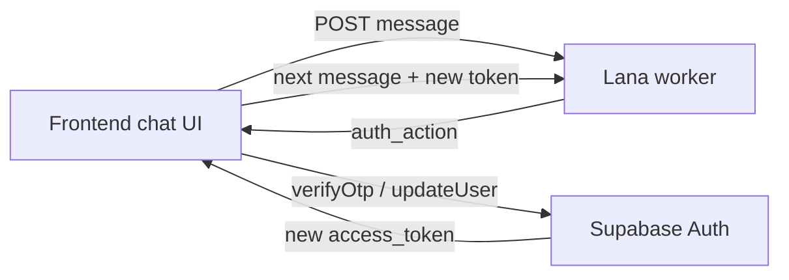

# Lana unified discovery — frontend handoff

**Audience:** mobile / PWA frontend team  
**Backend:** `tagalng-dev` · Lana worker on Cloud Run  
**Status:** v1 shipped and E2E-tested (June 2026)  
**Postman:** `docs/postman/TagAlng-Lana-Unified-Discovery.postman_collection.json`

This doc describes **exactly what backend shipped** for the new **unified Lana chat** model and how frontend should integrate it — especially the **discovery flow** (find similar neighbors) and **`auth_action`** OTP handoff.

**Related docs**

| Doc | Use |
|-----|-----|
| [`LANA_UNIFIED_ROUTING_FLOW.md`](./LANA_UNIFIED_ROUTING_FLOW.md) | Flow diagram + privacy rules |
| [`LANA_GUEST_SIGNUP_FRONTEND.md`](./LANA_GUEST_SIGNUP_FRONTEND.md) | Legacy guest signup (`profile_intake`) + in-chat login |
| [`GUEST_PWA_HANDOFF.md`](./GUEST_PWA_HANDOFF.md) | Older screen → API map |

**Base URLs (dev)**

| System | URL |
|--------|-----|
| Supabase | `https://rjlcyvwogmfmngemhbmn.supabase.co` |
| Lana worker | `https://tagalng-lana-worker-s5gmxb6whq-ue.a.run.app` |

---

## What changed (read this first)

### Old model (deprecated for new FE work)

- Frontend chose session mode at create: `purpose: "profile_intake"` or `"event_draft"`.
- Whole session stayed in that mode until complete.
- OTP verify was a separate screen; Postman collections mixed Lana + Supabase steps inconsistently.

### New model (what to build against)

- Frontend opens **one chat** — send **empty body** on session create.
- Backend defaults `purpose` to **`"lana"`** and **routes per message** (ZIP → identity → preview → verify gate → full matches).
- Frontend **does not** send `profile_intake` / `event_draft` for the main Meet Lana experience.
- When user needs auth, Lana returns **`auth_action`** — frontend must call **Supabase Auth** (Lana never verifies OTP itself).



---

## What backend built (exact scope)

| Area | What shipped |
|------|----------------|
| **DB migration** | `20260618120000_lana_unified_purpose.sql` — adds `'lana'` to `lana_session_purpose` enum |
| **Session default** | `POST /lana/sessions` with `{}` → `purpose: "lana"` |
| **Unified dispatcher** | `lana_dispatch.py` — opening message, per-turn routing entry |
| **Discovery routing** | `discovery_route.py` — find peers: ZIP → identity → preview → verify gate → full |
| **In-chat login** | Still works inside unified session (`guest_login.py`) — user says "log in" |
| **Auth handoff** | `auth_action` on responses — FE calls Supabase |
| **Deploy** | Lana worker revision `tagalng-lana-worker-00035-s98` (no redeploy needed for enum fix) |
| **Tests** | `tests/test_discovery_route.py` + Postman collection steps 1–8 |

**Not in this slice**

- Mid-session switch to `event_draft` host flow inside unified chat (legacy `event_draft` purpose still works separately).
- Full orchestrator on every turn (`lana` uses fast path, `orchestrator: false`).
- Backend-side OTP validation — **by design**, auth stays in Supabase.

---

## Prerequisites (Supabase Dashboard)

- Auth → **Anonymous sign-ins** ON
- Auth → **Manual linking** ON
- Auth → **Phone** provider ON
- Dev test numbers (optional): e.g. `+15550999012` / OTP `000000`

---

## API contract

### 1. Anonymous sign-in

```ts
const { data } = await supabase.auth.signInAnonymously();
const accessToken = data.session!.access_token;
// user.is_anonymous === true
```

REST: `POST /auth/v1/signup` with anon key, body `{}`.

### 2. Start unified Lana session

```http
POST /lana/sessions
Authorization: Bearer <anonymous access_token>
Content-Type: application/json

{}
```

**Do not send `purpose`** — backend defaults to `"lana"`.

**Response (highlights)**

```json
{
  "session_id": "uuid",
  "purpose": "lana",
  "status": "continue",
  "assistant_message": "Hey — I'm Lana, your block concierge. ...",
  "is_anonymous": true,
  "phone_verified": false,
  "home_block_assigned": false,
  "active_intent": null,
  "routing_phase": "listening",
  "auth_action": null,
  "peer_matches": [],
  "orchestrator": false
}
```

Store `session_id` — all messages use the same session.

### 3. Send messages (every turn)

```http
POST /lana/sessions/{session_id}/messages
Authorization: Bearer <access_token>
Content-Type: application/json

{ "message": "find people like me on the block" }
```

**Response fields frontend must read every turn**

| Field | Type | FE use |
|-------|------|--------|
| `assistant_message` | string | Render Lana bubble |
| `active_intent` | string \| null | e.g. `discovery.find_peers` |
| `routing_phase` | string \| null | Drive sub-flow UI (see table below) |
| `phone_verified` | boolean | **Source of truth** for verified state |
| `home_block_assigned` | boolean | User has `home_block_id` on profile |
| `peer_matches` | array | Preview or full neighbor cards |
| `auth_action` | object \| null | **When set, call Supabase immediately** |
| `routing.tool_called` | string | Debug / analytics |
| `orchestrator` | boolean | Always `false` for unified v1 |

### `routing_phase` values (discovery)

| Phase | Meaning | FE action |
|-------|---------|-----------|
| `listening` | Opening / no active intent | Show chat only |
| `need_zip` | Discovery started, need location | User types ZIP in chat (or location picker → send ZIP as message) |
| `need_identity` | Block resolved, need snippet | User describes themselves in chat |
| `preview` | Redacted peers shown | Show preview cards (`preview: true`, no names) |
| `await_signup_phone` | User asked for names/more, not verified | User sends phone in chat |
| `await_signup_otp` | Phone captured, waiting OTP in chat | User sends OTP in chat → then **FE must call Supabase** |

---

## Discovery flow — conversation script

Example happy path (messages user sends in chat):

| Step | User message | `routing_phase` after | Notes |
|------|--------------|----------------------|-------|
| 1 | *(session open)* | `listening` | Concierge greeting |
| 2 | `find people like me on the block` | `need_zip` | `active_intent: discovery.find_peers` |
| 3 | `32827` | `need_identity` | Backend calls `get_blocks_near_zip`, stores `preview_block_id` |
| 4 | `I'm a Latino mom looking for weekend activities` | `preview` | 3 redacted `peer_matches` |
| 5 | `show me their names and introduce me` | `await_signup_phone` | Verify gate |
| 6 | `+15550999012` | `await_signup_otp` | `auth_action: link_phone_signup` |
| 7 | `000000` | `preview` | `auth_action: verify_signup_otp` — **not verified yet** |
| 8 | *(FE calls Supabase verify)* | — | See auth section below |
| 9 | `ok` *(with new token)* | `preview` or full | `phone_verified: true` → full matches |

**Triggers for verify gate** (user wants more detail): words like *names, introduce, connect, show me, full, details, meet them*.

---

## Preview vs full `peer_matches`

### Preview (anonymous / unverified)

```json
{
  "peer_user_id": null,
  "nickname": null,
  "avatar_url": null,
  "similarity_score": null,
  "matching_peer_label": "Mom of toddlers",
  "preview": true
}
```

Show label only — **no names, IDs, or avatars**.

### Full (verified + block)

```json
{
  "peer_user_id": "uuid",
  "nickname": "Maria",
  "avatar_url": "https://...",
  "similarity_score": 0.82,
  "matching_peer_label": "Weekend activities",
  "preview": false
}
```

Only returned when `phone_verified: true` and user has block context.

---

## `auth_action` — critical frontend responsibility

> **Lana does not verify OTP.** It parses phone/OTP from chat and returns `auth_action` telling FE what Supabase call to make. Verification succeeds only after Supabase returns 200.

### `auth_action` shape

```json
{
  "type": "verify_signup_otp",
  "phone": "+15550999012",
  "token": "000000",
  "verify_type": "phone_change"
}
```

### Action types

| `auth_action.type` | When | Supabase JS | REST |
|--------------------|------|-------------|------|
| `link_phone_signup` | User gave phone during signup/discovery | `supabase.auth.updateUser({ phone })` | `PUT /auth/v1/user` with bearer = **anonymous session token** |
| `verify_signup_otp` | User gave OTP in chat (signup path) | `supabase.auth.verifyOtp({ phone, token, type: 'phone_change' })` | `POST /auth/v1/verify` |
| `send_login_otp` | User said "log in", gave phone | `supabase.auth.signInWithOtp({ phone })` | `POST /auth/v1/otp` |
| `verify_login_otp` | User gave OTP (login path) | `supabase.auth.verifyOtp({ phone, token, type: 'sms' })` | `POST /auth/v1/verify` |

### OTP types — do not mix

| Flow | Verify `type` | Why |
|------|---------------|-----|
| **Signup / discovery** (anonymous user linking phone) | `phone_change` | Keeps **same `user_id`** as Lana session |
| **Returning login** | `sms` | Signs into existing phone account |

Using `sms` during signup creates a **different user** → Lana returns `session_not_found`.

### Recommended FE handler

```ts
async function handleAuthAction(
  action: AuthActionPayload,
  supabase: SupabaseClient,
  lanaAccessToken: string,
): Promise<string> {
  switch (action.type) {
    case 'link_phone_signup': {
      await supabase.auth.updateUser({ phone: action.phone! });
      // Supabase sends OTP SMS automatically
      return lanaAccessToken; // same token until verify
    }
    case 'verify_signup_otp': {
      const { data, error } = await supabase.auth.verifyOtp({
        phone: action.phone!,
        token: action.token!,
        type: 'phone_change',
      });
      if (error) throw error;
      return data.session!.access_token; // NEW token — use for next Lana message
    }
    case 'send_login_otp': {
      await supabase.auth.signInWithOtp({ phone: action.phone! });
      return lanaAccessToken;
    }
    case 'verify_login_otp': {
      const { data, error } = await supabase.auth.verifyOtp({
        phone: action.phone!,
        token: action.token!,
        type: 'sms',
      });
      if (error) throw error;
      return data.session!.access_token;
    }
    default:
      return lanaAccessToken;
  }
}
```

### How to know verification actually succeeded

Check **after** Supabase verify returns 200:

```ts
const { data: { user } } = await supabase.auth.getUser();
// user.is_anonymous === false
// user.phone_confirmed_at !== null
```

On the **next Lana message**, response should show:

```json
{
  "phone_verified": true,
  "peer_matches": [ /* full matches, preview: false */ ]
}
```

If OTP was wrong, Supabase verify fails with 400 — `phone_verified` stays `false` on Lana.

**Common mistake:** Treating Lana step 8 response (`"Perfect — verifying you now..."`) as verified. It is not. `phone_verified: false` in that response confirms auth has not completed.

---

## Complete REST sequence (Postman / curl)

Steps 1–8 are Lana-only. Steps 9–10 are **required** for real verification.

### Steps 1–8 — Lana chat

1. `POST /auth/v1/signup` `{}` → `access_token`
2. `POST /lana/sessions` `{}` → `session_id`, `purpose: lana`
3. Message: `find people like me on the block`
4. Message: `32827`
5. Message: identity snippet
6. Message: `show me their names and introduce me`
7. Message: phone number → response has `auth_action.type: link_phone_signup`
8. Message: OTP code → response has `auth_action.type: verify_signup_otp`

### Step 9 — Link phone (if not already done via FE on step 7)

When step 7 returns `link_phone_signup`, call **before** or **when** you receive that `auth_action`:

```http
PUT /auth/v1/user
Authorization: Bearer <anonymous access_token>
apikey: <anon_key>
Content-Type: application/json

{ "phone": "+15550999012" }
```

### Step 10 — Verify OTP (actual verification)

When step 8 returns `verify_signup_otp`, use values from `auth_action`:

```http
POST /auth/v1/verify
apikey: <anon_key>
Content-Type: application/json

{
  "phone": "+15550999012",
  "token": "000000",
  "type": "phone_change"
}
```

Success → new `access_token`. Update bearer for all subsequent Lana calls.

### Step 11 — Resume Lana

```http
POST /lana/sessions/{session_id}/messages
Authorization: Bearer <new access_token>

{ "message": "ok show me full matches" }
```

Expect `phone_verified: true` and full `peer_matches`.

---

## Frontend implementation checklist

- [ ] `signInAnonymously()` on Meet Lana entry
- [ ] `POST /lana/sessions` with `{}` — no `purpose` field
- [ ] Single chat UI — user always types in one thread
- [ ] Read `routing_phase` + `active_intent` each turn (optional UI hints; Lana copy is primary)
- [ ] Render `peer_matches` — respect `preview: true` (hide names/avatars)
- [ ] On `auth_action` non-null → call Supabase **before** showing success
- [ ] After verify → refresh `access_token` → send next Lana message with new bearer
- [ ] Gate "connect / introduce" CTAs on `phone_verified === true`
- [ ] Do **not** use `purpose: profile_intake` for new unified flow
- [ ] In-chat login: handle `send_login_otp` / `verify_login_otp` with `type: sms`

---

## Legacy paths (still work, not for new FE)

| Purpose | Use |
|---------|-----|
| `profile_intake` | Old guest onboarding — Postman `TagAlng-Guest-Onboarding-Full` |
| `event_draft` | Host activity draft — separate flow |

Unified `lana` will add host routing in a later slice.

---

## Testing

| Asset | Path |
|-------|------|
| Unified discovery | `docs/postman/TagAlng-Lana-Unified-Discovery.postman_collection.json` |
| Environment | `docs/postman/TagAlng-tagalng-dev.postman_environment.json` |
| In-chat login | `docs/postman/TagAlng-Guest-InChat-Login.postman_collection.json` |

Set `anon_key` in environment. Use a **fresh test phone** per run for signup (`test_phone` / `test_otp` in env).

**Note:** Postman collection steps 1–8 end at `auth_action`. Add steps 9–10 (Supabase verify) manually or copy from `TagAlng-Guest-Onboarding-Full` folder "Phase 2 — Phone verify".

---

## Troubleshooting

| Symptom | Cause | Fix |
|---------|-------|-----|
| `invalid input value for enum lana_session_purpose: "lana"` | DB migration not applied | Backend applies `20260618120000` — should be fixed on dev |
| `phone_verified: false` after OTP message | FE skipped Supabase verify | Call `verifyOtp` / `POST /auth/v1/verify` |
| `session_not_found` after OTP | Used `type: sms` on signup | Use `phone_change` for anonymous signup |
| 522 on Supabase | Network / regional timeout | Retry; check project not paused |
| Preview peers but no names | Expected before verify | User must verify; then send another message |
| Real phone (non-test) | SMS OTP required | Use code from SMS, not `000000` |

---

## Questions for backend

- Event hosting inside unified `lana` session — not yet routed; use `event_draft` purpose temporarily if needed.
- `POST /lana/sessions/{id}/complete` after discovery-only flow — optional; full onboarding still uses complete for claims/embeddings.
