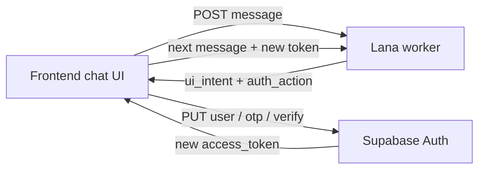

# Lana unified discovery — frontend handoff

**Audience:** mobile / PWA frontend team  
**Backend:** `tagalng-dev` · Lana worker on Cloud Run  
**Status:** v1.6 — unified chat + ranked peers + hosting/tip cards + CTA matrix (June 2026)  
**Postman:** `docs/postman/TagAlng-Lana-Unified-Full-E2E.postman_collection.json`  
**Reference FE:** `apps/admin/app/lana/meet/page.tsx` + `apps/admin/lib/demo-user.ts`

This doc describes **exactly what backend shipped** for the new **unified Lana chat** model and how frontend should integrate it — especially the **discovery flow** (find similar neighbors) and **`auth_action`** OTP handoff.

**Related docs**

| Doc | Use |
|-----|-----|
| [`LANA_UNIFIED_ROUTING_FLOW.md`](./LANA_UNIFIED_ROUTING_FLOW.md) | Flow diagram + privacy rules |
| [`LANA_GUEST_SIGNUP_FRONTEND.md`](./LANA_GUEST_SIGNUP_FRONTEND.md) | Legacy guest signup (`profile_intake`) + in-chat login |
| [`GUEST_PWA_HANDOFF.md`](./GUEST_PWA_HANDOFF.md) | Older screen → API map |

**Base URLs (dev)**

| System | URL |
|--------|-----|
| Supabase | `https://rjlcyvwogmfmngemhbmn.supabase.co` |
| Lana worker | `https://tagalng-lana-worker-s5gmxb6whq-ue.a.run.app` |

---

## What changed (read this first)

### Old model (deprecated for new FE work)

- Frontend chose session mode at create: `purpose: "profile_intake"` or `"event_draft"`.
- Whole session stayed in that mode until complete.
- OTP verify was a separate screen; Postman collections mixed Lana + Supabase steps inconsistently.

### New model (what to build against)

- Frontend opens **one chat** — send **empty body** on session create.
- Backend defaults `purpose` to **`"lana"`** and **routes per message** (ZIP → identity → display name → preview → verify gate → full matches).
- Frontend **does not** send `profile_intake` / `event_draft` for the main Meet Lana experience.
- When user needs auth, Lana returns **`ui_intent`** (what input to show) and **`auth_action`** (what Supabase call to make). Frontend must call **Supabase Auth** — Lana never verifies OTP itself.



---

## What backend built (exact scope)

| Area | What shipped |
|------|----------------|
| **DB migration** | `20260618120000_lana_unified_purpose.sql` — adds `'lana'` to `lana_session_purpose` enum |
| **Session default** | `POST /lana/sessions` with `{}` → `purpose: "lana"` |
| **Unified pipeline** | `lana_unified_pipeline.py` — discovery gates (code) + orchestrator (AI) per turn |
| **Discovery routing** | `discovery_route.py` — ZIP → identity → **display name** → preview → verify gate → full |
| **`ui_intent`** | `ui_intent.py` — stable FE signal for phone/OTP/ZIP/name fields (see table below) |
| **In-chat login** | `guest_login.py` — user says "log in" → `await_login_phone` / `await_login_otp` |
| **In-chat logout** | User says "log out" / "sign out" → `auth_action: logout` (signed-in users only) |
| **Profile photo** | User says "upload my picture" → `ui_intent: upload_profile_photo` + `POST /lana/profile-photo` |
| **Session resume** | `POST /lana/sessions` resumes active session per user; `{ "force_new": true }` for fresh thread |
| **In-chat signup** | Discovery verify gate → `await_signup_phone` / `await_signup_otp` |
| **Auth handoff** | `auth_action` on responses — FE calls Supabase (see reference impl) |
| **Incremental claims** | Each identity message → background extract → `user_identity_claims` upsert |
| **Nickname** | `"my name is …"` → `users.nickname` sync; discovery asks name if missing |
| **`activity_previews`** | Activity browse returns cards separate from `peer_matches` |
| **Ranked peer discovery (C-FIND-MOM-RESULTS)** | `peer_discovery_surface.py` — `match_stars`, badges, trait chips, per-card **Nudge**, `discovery_surface` summary |
| **Hosting draft (C-4-EVENT-P3)** | `hosting_surface.py` — structured `signal_saved.hosting` + **Open the meet up** / **Send to a mom** for `host_meet` |
| **Tip share draft (C-4-RECO-P3)** | `tip_surface.py` — structured `signal_saved.tip` + **Pass the tip along** / **Send to a mom** for `tip_share` |
| **CTA routing fixes** | Duplicate-intro → **Show my intros**; swap/meet/tip seek save → **Show my block log**; turn-scoped surfaces prevent stale buttons |
| **Tests** | `tests/test_discovery_route.py`, `tests/test_ui_intent.py`, `tests/test_ui_actions.py`, `tests/test_claims_persist.py`, `tests/test_peer_discovery_surface.py`, `tests/test_hosting_cta.py` |

**Not in this slice**

- Mid-session switch to `event_draft` host flow inside unified chat (legacy `event_draft` purpose still works separately).
- Backend-side OTP validation — **by design**, auth stays in Supabase.

**Orchestrator:** may be on per env (`LANA_ORCHESTRATOR`); discovery privacy gates (ZIP, phone, OTP) stay **code-first** regardless.

---

## Prerequisites (Supabase Dashboard)

- Auth → **Anonymous sign-ins** ON
- Auth → **Manual linking** ON
- Auth → **Phone** provider ON
- Dev test numbers (optional): e.g. `+15550999012` / OTP `000000`

---

## API contract

### 1. Anonymous sign-in

```ts
const { data } = await supabase.auth.signInAnonymously();
const accessToken = data.session!.access_token;
// user.is_anonymous === true
```

REST: `POST /auth/v1/signup` with anon key, body `{}`.

### 2. Start unified Lana session

```http
POST /lana/sessions
Authorization: Bearer <anonymous access_token>
Content-Type: application/json

{}
```

**Do not send `purpose`** — backend defaults to `"lana"`.

**Session resume:** If this user already has an **active** `lana` session, the API returns that same `session_id` and the last assistant message (no new opening bubble). Pass `{ "force_new": true }` only when you intentionally want a blank thread (e.g. debug or “start over” after logout).

**Response (highlights)**

```json
{
  "session_id": "uuid",
  "purpose": "lana",
  "status": "continue",
  "assistant_message": "Hey — I'm Lana, your block concierge. ...",
  "is_anonymous": true,
  "phone_verified": false,
  "home_block_assigned": false,
  "active_intent": null,
  "routing_phase": "listening",
  "ui_intent": "chat",
  "auth_action": null,
  "peer_matches": [],
  "activity_previews": [],
  "orchestrator": false
}
```

Store `session_id` — all messages use the same session.

### 3. Send messages (every turn)

```http
POST /lana/sessions/{session_id}/messages
Authorization: Bearer <access_token>
Content-Type: application/json

{ "message": "find people like me on the block" }
```

**Response fields frontend must read every turn**

| Field | Type | FE use |
|-------|------|--------|
| `assistant_message` | string | Render Lana bubble |
| `active_intent` | string \| null | e.g. `discovery.find_peers` |
| `routing_phase` | string \| null | Debug / analytics phase (see table below) |
| `ui_intent` | string \| null | **Drive input UI** — phone field, OTP field, ZIP, etc. (see table) |
| `ui_actions` | array | **Bubble CTAs** — render buttons; tap → POST `message` to Lana |
| `pending_intros` | array | Intro inbox rows; `direction: received` rows include `actions` |
| `intro_proposal` | object \| null | Just-sent intro metadata |
| `signal_saved` | object \| null | Listening / dropped-in signal summary |
| `block_log_entries` | array | Block log match cards |
| `phone_verified` | boolean | **Source of truth** for verified state |
| `home_block_assigned` | boolean | User has `home_block_id` on profile |
| `peer_matches` | array | Preview or full neighbor cards (see **Ranked peer cards** below) |
| `discovery_surface` | object \| null | Summary pill + weak-match prompt metadata when peers are shown |
| `activity_previews` | array | Activity browse cards (when user asks for events) |
| `auth_action` | object \| null | **When set, call Supabase immediately** (same turn as user message) |
| `auth_intent` | string \| null | `login` \| `logout` during auth sub-flows (analytics / debug) |
| `login_phone` | string \| null | Phone captured during in-chat login (hint for OTP UI) |
| `requires_login_otp` | boolean | Login OTP step active |
| `routing.tool_called` | string | Debug / analytics |
| `orchestrator` | boolean | Whether AI orchestrator ran this turn |

### `ui_intent` — **primary FE driver** (use this for input chrome)

Read **`ui_intent` every turn** (session create + each message). Switch UI based on it; use `routing_phase` only for debug/analytics.

| `ui_intent` | Show in UI |
|-------------|------------|
| `chat` | Default message composer |
| `collect_zip` | ZIP input (`inputMode=numeric`, max 5 digits) |
| `collect_identity` | Free-text “about you” |
| `collect_display_name` | First-name field — saved to `users.nickname` |
| `collect_phone` | Phone field (`type=tel`) + **Continue** → send as Lana message |
| `collect_otp` | OTP field (6 digits) + **Verify** → send as Lana message, then run `auth_action` |
| `show_peer_preview` | Ranked neighbor cards (`peer_matches`) + optional weak-match `ui_actions` |
| `show_activity_preview` | Activity cards (`activity_previews`) |
| `confirm_profile` | “That’s me ✓” / `POST …/complete` when `ready_to_complete` |
| `upload_profile_photo` | **Add photo** button → file picker / camera → `POST /lana/profile-photo` (not a URL field) |
| `sign_out` | **Sign out** — call Supabase `signOut()` via `auth_action: logout` (same turn) |
| `show_pending_intros` | Intro inbox (`pending_intros`) — received rows include per-row `actions` |
| `respond_pending_intro` | Single intro waiting on user — use top-level `ui_actions` (C-8 accept / not now) |
| `offer_neighbor_intro` | Match card + `ui_actions` e.g. **Send Maria a nudge** / **Not yet** |
| `propose_neighbor_intro` | Intro sent — `intro_proposal` + optional `pending_intros` |
| `show_block_log` | Block log cards (`block_log_entries`) + bubble `ui_actions` (see matrix below) |
| `signal_saved` | Signal card (`signal_saved`) + bubble `ui_actions` — varies by `signal_saved.intent` (see matrix) |
| `show_identity_profile` | Claims dashboard (`identity_profile`) |
| `collect_signal_detail` | Signal capture confirm — e.g. **Where, roughly?** for tip share |

### `ui_intent` → surfaces → `ui_actions` (master matrix)

**Rule:** render bubble `ui_actions` only when the array is non-empty. Tapping a button **POSTs `action.message`** to Lana (same as typing). Per-card `peer_matches[].actions` and `pending_intros[].actions` use the same shape.

| `ui_intent` | Render these payloads | Bubble `ui_actions` (when set) | Notes |
|-------------|----------------------|------------------------------|-------|
| `chat` | composer only | `[]` | Default |
| `collect_zip` | ZIP field | `[]` | `routing_phase: need_zip` |
| `collect_identity` | free text | `[]` | |
| `collect_display_name` | name field | `[]` | |
| `collect_phone` | phone field | `[]` | Send phone as Lana message first |
| `collect_otp` | OTP field | `[]` | Then run `auth_action` |
| `collect_signal_detail` | composer (+ optional draft chips) | `[]` | `signal_draft` active — tip may ask **Where, roughly?** |
| `show_peer_preview` | `peer_matches` + `discovery_surface` | weak-match pair **or** `[]` | Per-card **Nudge** on each row |
| `show_activity_preview` | `activity_previews` | `[]` | |
| `show_identity_profile` | `identity_profile` | `[]` | |
| `confirm_profile` | confirm UI | `[]` | `ready_to_complete` |
| `upload_profile_photo` | file picker | `[]` | `POST /lana/profile-photo` |
| `sign_out` | logout confirm | `[]` | run `auth_action: logout` |
| `offer_neighbor_intro` | match context | **Send {nick} a nudge** / **Not yet** | `intro_propose` / `intro_pass` |
| `respond_pending_intro` | intro context | **Yes, introduce us** / **Not now** | `intro_accept` / `intro_decline` |
| `propose_neighbor_intro` | `intro_proposal` + optional `pending_intros` | **Got it** → `show my intros` | `intro_sent_ack` |
| `show_pending_intros` | `pending_intros` inbox | `[]` | row-level `actions` on `direction: received` |
| `show_block_log` | `block_log_entries` | see **block log** row below | duplicate intro overrides nudge |
| `signal_saved` | `signal_saved` card | see **signal_saved** row below | `hosting` / `tip` sub-cards when present |

#### Bubble `ui_actions` by scenario

| Scenario | `id` | Label | `message` | `style` |
|----------|------|-------|-----------|---------|
| **Peer weak-match** (bottom, `show_peer_preview`) | `peer_wait_stronger` | Wait for stronger | `wait for stronger matches` | secondary |
| | `peer_nudge_weak` | Nudge {nick} anyway | `introduce me to {nickname}` | primary |
| **Intro offer** (`offer_neighbor_intro`) | `intro_propose` | Send {nick} a nudge | `introduce me to {nick}` | primary |
| | `intro_pass` | Not yet | `not now` | secondary |
| **Intro respond** (`respond_pending_intro`) | `intro_accept` | Yes, introduce us | `yes introduce us` | primary |
| | `intro_decline` | Not now | `not now` | secondary |
| **Intro already sent** (`show_block_log` + `recent_intro_duplicate`) | `intro_show_inbox` | Show my intros | `show my intros` | primary |
| | `intro_pass` | Not yet | `not now` | secondary |
| **Intro just sent** (`propose_neighbor_intro`) | `intro_sent_ack` | Got it | `show my intros` | primary |
| **Block log — new match** (`show_block_log`, no duplicate) | `block_log_nudge` | Introduce me to #1 **or** Send {nick} a nudge | `introduce me to #1` **or** `introduce me to {nick}` | primary |
| | `block_log_pass` | Not now | `maybe later` | secondary |
| **Signal saved — swap/meet/tip seek** (`signal_saved`, intent ≠ host/tip_share) | `signal_show_block_log` | Show my block log | `show my block log` | primary |
| | `signal_wait` | Not yet | `maybe later` | secondary |
| **Signal saved — host_meet** (`signal_saved.intent === host_meet`, not opened) | `hosting_open` | Open the meet up | `open the meet up` | primary |
| | `hosting_send` | Send to a mom | `send to a mom` | secondary |
| **Signal saved — host_meet opened** | — | *(none)* | — | `hosting_opened: true` → empty `ui_actions` |
| **Signal saved — tip_share** (`signal_saved.intent === tip_share`, not passed) | `tip_pass` | Pass the tip along | `pass the tip along` | primary |
| | `tip_send_mom` | Send to a mom | `send to a mom` | secondary |

#### Per-card `actions` (not bubble `ui_actions`)

| Surface | `id` | Label | `message` |
|---------|------|-------|-----------|
| `peer_matches[]` (ranked discovery) | `peer_card_nudge` | Nudge | `introduce me to {nickname}` |
| `pending_intros[]` (`direction: received`, `status: proposed`) | `intro_accept` | Yes, introduce us | `yes introduce us` |
| | `intro_decline` | Not now | `not now` |

**Do not confuse:**

| User goal | Correct CTA | Wrong CTA |
|-----------|-------------|-----------|
| Posted swap/meet/tip **seek** — check matches | **Show my block log** | Show my intros |
| Already **sent intro** — check inbox | **Show my intros** | Send them a nudge |
| **Block log** row — first nudge | **Introduce me to #1** / Send {nick} a nudge | Show my intros |

**Turn-scoped payloads** (cleared each turn unless backend re-stamps): `signal_saved`, `block_log_entries`, `identity_profile`, `pending_intros`, `recent_intro_duplicate`. Stale session values must not drive buttons on unrelated turns.

### `ui_actions` — field shape

Every turn may include `ui_actions: []`. When non-empty, render as primary/secondary buttons **below the Lana bubble** (per walkthrough C-8, C-4 SNAP-P3).

| Field | Type | Meaning |
|-------|------|---------|
| `id` | string | Stable action id — see matrix above |
| `label` | string | Button copy |
| `message` | string | **POST this as the user message** to Lana on tap (same as typing) |
| `style` | `primary` \| `secondary` \| `ghost` | Visual weight |
| `intro_id` | string? | Target intro when accepting/declining |
| `peer_user_id` | string? | Target neighbor for nudge |

### `active_intent` (debug / analytics — not primary FE driver)

Backend sets `active_intent` from Layer 1 routing. Pair with `ui_intent` for logging only.

| `active_intent` | Typical `ui_intent` |
|-----------------|---------------------|
| `discovery.find_peers` / `discovery.find_by_attrs` | `show_peer_preview` |
| `discovery.block_log` | `show_block_log` |
| `looking.swap` / `looking.meet` / `looking.tip` | `signal_saved` or `collect_signal_detail` |
| `sharing.swap` / `sharing.host` / `sharing.tip` | `signal_saved` |
| `social.list_intros` | `show_pending_intros` |
| `social.propose_intro` | `propose_neighbor_intro` or `offer_neighbor_intro` |
| `tier.respond_nudge` | `respond_pending_intro` |
| `identity.show_my_profile` | `show_identity_profile` |

`signal_saved.intent` values: `swap_seek`, `swap_offer`, `meet_seek`, `host_meet`, `tip_seek`, `tip_share`.

### `ui_actions` — implementation

```ts
async function onUiAction(action: LanaUiAction) {
  await sendMessage(token, sessionId, action.message);
}
```

`pending_intros[].actions` uses the same shape for per-row buttons in the inbox list.

**Pairing with `auth_action`:** user can type phone/OTP in chat *or* use dedicated fields — both work. On the turn where Lana parses phone/OTP, check `auth_action` and call Supabase **before** treating auth as done.

> **Do not** call `PUT /auth/v1/user` when the user taps **Send code** if Lana has not returned `auth_action` yet.  
> On the verify gate turn (`collect_phone`, `auth_action: null`), **Send code** must **POST the phone to Lana** first (same as typing it in chat). Lana replies with `ui_intent: collect_otp` and `auth_action.type: link_phone_signup` — **then** run Supabase PUT.

```ts
// Correct "Send code" handler (collect_phone card)
async function onSendCode(phone: string) {
  const turn = await sendMessage(token, sessionId, normalizeE164(phone));
  applyTurn(turn);
  const action = authActionFromTurn(turn);
  if (action?.type === 'link_phone_signup') {
    await handleLanaAuthAction(action); // PUT /auth/v1/user + refresh session
  }
}
```

```ts
// After every Lana message:
applyTurn(turn); // read ui_intent, peer_matches, routing_phase, etc.
const action = authActionFromTurn(turn);
if (action) {
  const newToken = await handleLanaAuthAction(action);
  // signup: same session_id, new token
  // login: new user_id → start new Lana session (see below)
  // logout: signOut → new anonymous JWT → new Lana session (see below)
}
```

TypeScript types: `apps/admin/lib/lana-client.ts` → `LanaUiIntent`, `AuthActionPayload`.

### `routing_phase` values (debug / analytics)

| Phase | Typical `ui_intent` | Meaning |
|-------|---------------------|---------|
| `listening` | `chat` | Opening / no active discovery |
| `need_zip` | `collect_zip` | Need 5-digit US ZIP |
| `need_identity` | `collect_identity` | Need heritage / life stage / what they want |
| `need_display_name` | `collect_display_name` | Need `users.nickname` before preview |
| `preview` | `show_peer_preview` or `show_activity_preview` | Cards shown |
| `gate_verify` / `await_signup_phone` | `collect_phone` | Signup verify gate — need phone |
| `await_signup_otp` | `collect_otp` | Signup — need OTP (`phone_change`) |
| `await_login_phone` | `collect_phone` | In-chat login — need phone |
| `await_login_otp` | `collect_otp` | In-chat login — need OTP (`sms`) |
| `await_profile_photo` | `upload_profile_photo` | Waiting for file upload via `POST /lana/profile-photo` |
| `await_logout` | `sign_out` | User asked to log out — FE runs `auth_action: logout` |

---

## Discovery flow — conversation script

Example happy path (messages user sends in chat):

| Step | User message | `ui_intent` after | `routing_phase` | Notes |
|------|--------------|-------------------|-----------------|-------|
| 1 | *(session open)* | `chat` | `listening` | Concierge greeting |
| 2 | `find people like me on the block` | `collect_zip` | `need_zip` | `active_intent: discovery.find_peers` |
| 3 | `32827` | `collect_identity` | `need_identity` | `get_blocks_near_zip` → `preview_block_id` |
| 4 | `I'm a Latino mom…` | `collect_display_name` | `need_display_name` | If `users.nickname` empty |
| 5 | `Marina` | `show_peer_preview` | `preview` | 3 redacted `peer_matches` |
| 6 | `show me their names` | `collect_phone` | `await_signup_phone` | Verify gate (anonymous) |
| 7 | `+15550999012` | `collect_otp` | `await_signup_otp` | `auth_action: link_phone_signup` → FE **PUT /user** |
| 8 | `000000` | `collect_otp` | `await_signup_otp` | `auth_action: verify_signup_otp` → FE **POST /verify** `phone_change` |
| 9 | `ok` *(new bearer)* | `show_peer_preview` or full | `preview` | `phone_verified: true` → full matches |

**Triggers for verify gate** (user wants more detail): words like *names, introduce, connect, show me, full, details, meet them*.

**Logged-in users** (`phone_verified: true` from in-chat login): preview copy does not ask to verify again; full matches when `home_block_id` is set.

**Identity claims:** heritage/life-stage lines are upserted to `user_identity_claims` in the background during chat (not only on session complete).

---

## Preview vs full `peer_matches`

### Preview (anonymous / unverified)

```json
{
  "peer_user_id": null,
  "nickname": null,
  "avatar_url": null,
  "similarity_score": null,
  "matching_peer_label": "Mom of toddlers",
  "preview": true
}
```

Show label only — **no names, IDs, or avatars**.

### Full (verified + block)

```json
{
  "peer_user_id": "uuid",
  "nickname": "Maria",
  "avatar_url": "https://...",
  "similarity_score": 0.82,
  "matching_peer_label": "Weekend activities",
  "preview": false
}
```

Only returned when `phone_verified: true` and user has block context.

### Ranked peer cards (v1.4 — C-FIND-MOM-RESULTS)

When `ui_intent` is `show_peer_preview` (or peers surface during discovery), each **verified** row may include enrichment fields. All are **optional** — legacy clients can keep rendering `matching_peer_label` + `%` score.

```json
{
  "peer_user_id": "uuid",
  "nickname": "Kashaf",
  "similarity_score": 0.88,
  "matching_peer_label": "American mom · Weekend hikes",
  "preview": false,
  "match_stars": 5,
  "match_band": "strong",
  "match_badge": "PERFECT FIT",
  "trait_tags": ["American mom", "Weekend hikes"],
  "actions": [
    {
      "id": "peer_card_nudge",
      "label": "Nudge",
      "message": "introduce me to Kashaf",
      "style": "primary",
      "peer_user_id": "uuid"
    }
  ]
}
```

| Field | FE use |
|-------|--------|
| `match_stars` | `1`–`5` star display (prefer over raw `%` when present) |
| `match_badge` | Chip: `PERFECT FIT`, `STRONG`, `PARTIAL`, `WEAK` |
| `trait_tags` | Short chips parsed from `matching_peer_label` |
| `actions` | Per-card **Nudge** — same tap contract as `ui_actions` |

Top-level `discovery_surface` (when peers are shown):

```json
{
  "strong_count": 2,
  "partial_count": 1,
  "weak_count": 1,
  "status_label": "2 strong fits · 1 partial",
  "weak_peer": {
    "peer_user_id": "uuid",
    "nickname": "Helena",
    "match_stars": 2,
    "match_badge": "WEAK"
  },
  "ranked_summary": "KASHAF 5/5 · ADA 4/5"
}
```

| Field | FE use |
|-------|--------|
| `status_label` | Status pill above Lana (e.g. **2 strong fits · 1 partial**) |
| `weak_peer` | When set with mixed strong/partial + weak rows, render bottom `ui_actions` |

When `weak_peer` is set and `ui_intent === show_peer_preview`, `ui_actions` may include:

| `id` | Label | `message` |
|------|-------|-----------|
| `peer_wait_stronger` | Wait for stronger | `wait for stronger matches` |
| `peer_nudge_weak` | Nudge {name} anyway | `introduce me to {nickname}` |

Preview rows (`preview: true`) still omit names, scores, `actions`, and `discovery_surface` is omitted until full matches.

### Hosting draft card (v1.5 — C-4-EVENT-P3)

Swap, tip seek, and meet seek signals use the simple `signal_saved` card and **Show my block log** / **Not yet** CTAs.

When `sharing.host` saves a meetup (`signal_saved.intent === "host_meet"`), the turn includes a structured **`hosting`** object on `signal_saved`:

```json
{
  "signal_saved": {
    "intent": "host_meet",
    "detail_text": "Brazilian coffee Saturday morning at Foxtail",
    "matches_created": 3,
    "hosting": {
      "title": "Brazilian coffee",
      "headline": "Heard you — Brazilian coffee.",
      "when_label": "Saturday morning",
      "where_label": "Foxtail · Lake Nona",
      "who_label": "Neighbors on your block",
      "trait_tags": ["Brazilian coffee", "Saturday morning", "Foxtail · Lake Nona"],
      "status_label": "Ready to open it up",
      "outreach_copy": "I'll text the 3 closest fits on your block."
    }
  },
  "ui_intent": "signal_saved",
  "ui_actions": [
    { "id": "hosting_open", "label": "Open the meet up", "message": "open the meet up", "style": "primary" },
    { "id": "hosting_send", "label": "Send to a mom", "message": "send to a mom", "style": "secondary" }
  ]
}
```

| Field | FE use |
|-------|--------|
| `hosting` | EVENT-P3 card — WHEN / WHERE / WHO + trait chips |
| `hosting.status_label` | Status pill — e.g. **Lana · ready to open it up** or **open on your block** after CTA |
| `hosting_opened` | When true — hide hosting CTAs; card shows **Open on your block** |
| `ui_actions` | **Open the meet up** / **Send to a mom** (`host_meet` only) |

### Tip share card (v1.6 — C-4-RECO-P3)

When `sharing.tip` saves a recommendation (`signal_saved.intent === "tip_share"`), the turn may include **`tip`** on `signal_saved`:

```json
{
  "signal_saved": {
    "intent": "tip_share",
    "category": "health",
    "detail_text": "Dr. Smith · doctor",
    "tip": {
      "title": "Dr. Smith · doctor",
      "headline": "Heard you — Dr. Smith · doctor.",
      "where_label": "Lake Nona",
      "trait_tags": ["gentle", "takes insurance"],
      "status_label": "Ready to pass it along",
      "outreach_copy": "I'll listen for moms on your block who need this."
    }
  },
  "ui_intent": "signal_saved",
  "ui_actions": [
    { "id": "tip_pass", "label": "Pass the tip along", "message": "pass the tip along", "style": "primary" },
    { "id": "tip_send_mom", "label": "Send to a mom", "message": "send to a mom", "style": "secondary" }
  ]
}
```

| Field | FE use |
|-------|--------|
| `tip` | RECO-P3 card — title, trait chips, WHERE when known |
| `tip.status_label` | Status pill — e.g. **Lana · ready to pass it along** |
| `collect_signal_detail` | May precede save — Lana asks **Where, roughly?** before card is final |

**Tip seek** (`tip_seek`, looking for a recommendation) uses the simple signal card + **Show my block log** / **Not yet** (same as swap seek).

**Do not** show hosting card for doctor/tip utterances — `signal_saved.intent` must be `tip_share`, not `host_meet`.

---

## `auth_action` — critical frontend responsibility

> **Lana does not verify OTP.** It parses phone/OTP from chat and returns `auth_action` telling FE what Supabase call to make. Verification succeeds only after Supabase returns 200.

### `auth_action` shape

```json
{
  "type": "verify_signup_otp",
  "phone": "+15550999012",
  "token": "000000",
  "verify_type": "phone_change"
}
```

### Action types

| `auth_action.type` | When | REST (canonical — matches our PWA) |
|--------------------|------|-------------------------------------|
| `link_phone_signup` | User gave phone during signup/discovery | `PUT /auth/v1/user` — bearer = **guest `access_token`** |
| `verify_signup_otp` | User gave OTP (signup path) | `POST /auth/v1/verify` — `type: "phone_change"`, bearer = **anon key** |
| `send_login_otp` | User said "log in", gave phone | `POST /auth/v1/otp` — bearer = **anon key**, `create_user: false` |
| `verify_login_otp` | User gave OTP (login path) | `POST /auth/v1/verify` — `type: "sms"`, bearer = **anon key** |
| `logout` | Signed-in user said "log out" / "sign out" | `POST /auth/v1/logout` or client `signOut()` — then fresh anonymous session |

### OTP types — do not mix

| Flow | Verify `type` | Why |
|------|---------------|-----|
| **Signup / discovery** (anonymous user linking phone) | `phone_change` | Keeps **same `user_id`** as Lana session |
| **Returning login** | `sms` | Signs into **existing** phone account (new `user_id`) |

Using `sms` during signup creates a **different user** → Lana returns `session_not_found`.

---

## How our app does signup & login (copy this)

**Reference code:** `apps/admin/lib/demo-user.ts` (`handleLanaAuthAction`, `authActionFromTurn`) + `apps/admin/app/lana/meet/page.tsx` (`pushTurn`).

**Env:** `NEXT_PUBLIC_SUPABASE_URL`, `NEXT_PUBLIC_SUPABASE_ANON_KEY`, `NEXT_PUBLIC_LANA_WORKER_URL`.

### A. App entry — anonymous guest

Every “Meet Lana” tap starts fresh anonymous auth (Postman E2E step 1):

```http
POST /auth/v1/signup
apikey: <anon_key>
Authorization: Bearer <anon_key>
Content-Type: application/json

{}
```

→ `access_token` (`user.is_anonymous === true`). Store in your auth client.

Then:

```http
POST /lana/sessions
Authorization: Bearer <access_token>
Content-Type: application/json

{}
```

→ `session_id` — keep for the whole signup chat.

### B. Signup (discovery) — same `user_id`, same `session_id`

User chats phone + OTP in Lana (or uses `ui_intent` phone/OTP fields). After **each** `POST …/messages`:

```ts
async function pushTurn(accessToken: string, sessionId: string, text: string) {
  const turn = await sendMessage(accessToken, sessionId, text);
  renderBubble(turn.assistant_message);
  setUiFromTurn(turn); // ui_intent, peer_matches, etc.

  const action = authActionFromTurn(turn);
  if (!action) return turn;

  const newToken = await handleLanaAuthAction(action);
  if (action.type === 'verify_signup_otp') {
    // SAME session_id, NEW bearer after phone_change
    const resume = await sendMessage(newToken, sessionId, 'ok');
    return resume;
  }
  return turn;
}
```

| Step | User / Lana | `ui_intent` | Supabase call (when `auth_action` set) |
|------|-------------|-------------|----------------------------------------|
| 1 | User: phone in chat | `collect_otp` | `link_phone_signup` → **PUT /auth/v1/user** |
| 2 | User: OTP in chat | `collect_otp` | `verify_signup_otp` → **POST /verify** `phone_change` |
| 3 | FE: `sendMessage(…, 'ok')` | `show_peer_preview` | None — `phone_verified: true` on response |

**PUT /auth/v1/user** (link phone — signup):

```http
PUT /auth/v1/user
apikey: <anon_key>
Authorization: Bearer <anonymous access_token>
Content-Type: application/json

{ "phone": "+15550999012" }
```

Refresh anonymous JWT before link if idle >1h (`POST /auth/v1/token?grant_type=refresh_token` or client `refreshSession()`).

**POST /auth/v1/verify** (signup OTP):

```http
POST /auth/v1/verify
apikey: <anon_key>
Authorization: Bearer <anon_key>
Content-Type: application/json

{
  "phone": "+15550999012",
  "token": "000000",
  "type": "phone_change"
}
```

→ new `access_token` — **same `user_id`**. Use for all further Lana calls on **same `session_id`**.

> **Important:** Do **not** use `signInWithOtp` for login while the anonymous Lana session is in storage — it overwrites the guest session. Use raw `POST /auth/v1/otp` for login (see below).

### C. Login (returning user) — new `user_id`, new Lana session

User says “log in” in chat. Phases: `await_login_phone` → `await_login_otp` (`ui_intent`: `collect_phone` → `collect_otp`).

| Step | User / Lana | `auth_action` | Supabase |
|------|-------------|---------------|----------|
| 1 | User: phone | `send_login_otp` | **POST /auth/v1/otp** |
| 2 | User: OTP | `verify_login_otp` | **POST /verify** `type: "sms"` |
| 3 | FE | — | **New** `POST /lana/sessions` with login token |

**POST /auth/v1/otp** (send login code — does not replace guest session in our impl):

```http
POST /auth/v1/otp
apikey: <anon_key>
Authorization: Bearer <anon_key>
Content-Type: application/json

{ "phone": "+15550000000", "create_user": false }
```

**POST /auth/v1/verify** (login OTP):

```http
POST /auth/v1/verify
apikey: <anon_key>
Authorization: Bearer <anon_key>
Content-Type: application/json

{
  "phone": "+15550000000",
  "token": "000000",
  "type": "sms"
}
```

→ `setSession` with returned tokens → **new `user_id`**. Abandon guest `session_id`; call `POST /lana/sessions` again.

```ts
if (action.type === 'verify_login_otp') {
  const loginToken = await verifyLoginOtp(phone, otp); // sms
  const lana = await startUnifiedSession(loginToken);  // NEW session_id
  setSessionId(lana.session_id);
}
```

### D. Logout (signed-in user) — new anonymous session

User says “log out” / “sign out” / “I want to logout” in chat. Lana replies with a farewell and sets:

```json
{
  "auth_action": { "type": "logout" },
  "auth_intent": "logout",
  "ui_intent": "sign_out",
  "routing_phase": "await_logout"
}
```

All three align on the logout turn (same pattern as login’s `collect_phone` + `await_login_phone` + `send_login_otp`).

**When `ui_intent === 'sign_out'` or `auth_action.type === 'logout'`** (same turn as the user message):

1. Call Supabase **`signOut()`** (or `POST /auth/v1/logout` with current bearer).
2. Start a **new anonymous** session (`POST /auth/v1/signup` `{}` or `signInAnonymously()`).
3. Call **`POST /lana/sessions`** with the new anon token — use `{ "force_new": true }` so you do not resume the signed-in user's old thread.
4. Reset local chat state (clear `peer_matches`, `phone_verified`, signed-in profile UI).

```ts
if (turn.ui_intent === 'sign_out' || action?.type === 'logout') {
  await supabase.auth.signOut();
  const { data } = await supabase.auth.signInAnonymously();
  const anonToken = data.session!.access_token;
  const lana = await lanaFetch('/lana/sessions', anonToken, {
    method: 'POST',
    body: JSON.stringify({ force_new: true }),
  });
  setSessionId(lana.session_id);
  setAccessToken(anonToken);
  // Lana's farewell is already in turn.assistant_message; optional append lana.assistant_message as fresh opening
}
```

**Not signed in** (anonymous guest, no verified phone): Lana says there is nothing to log out of — **no** `auth_action`.

**Already signed in + says “log in”:** Lana does **not** re-ask for phone; she says you're already signed in (no `auth_action`).

**Stuck in login phone step:** “no thanks” / “build my profile” / any non-phone message exits login back to `ui_intent: chat` (no `auth_action`).

### E. `authActionFromTurn` — fallback when `auth_action` omitted

Login OTP can also be inferred from turn fields (see `demo-user.ts`):

```ts
function authActionFromTurn(turn): AuthActionPayload | null {
  if (turn.auth_action?.type) return turn.auth_action;
  if (turn.login_otp_token && turn.login_phone) {
    return { type: 'verify_login_otp', phone: turn.login_phone, token: turn.login_otp_token, verify_type: 'sms' };
  }
  if (turn.requires_login_otp && turn.login_phone) {
    return { type: 'send_login_otp', phone: turn.login_phone, verify_type: 'sms' };
  }
  return null;
}
```

### F. Profile photo upload

**Not a URL in chat.** User picks a file (gallery or camera). Flash slots set `goal: profile_photo` (same AI router as discovery) → Lana sets `ui_intent: upload_profile_photo` when:

- User wants to add/change their picture (any phrasing)
- User says “yes” after Lana suggested a photo (`profile_photo_action: accept`)
- Session is already in `routing_phase: await_profile_photo`
- User says they’re done (`profile_photo_action: done`) or cancels (`skip`)

**Chat turn (user asks):**

```json
{
  "assistant_message": "Great — tap Add photo below to choose from your gallery or take one.",
  "ui_intent": "upload_profile_photo",
  "routing_phase": "await_profile_photo",
  "profile_photo_intent": "upload"
}
```

**Upload endpoint (separate from chat message):**

```http
POST /lana/profile-photo
Authorization: Bearer <access_token>
Content-Type: multipart/form-data

file=<image/jpeg|png|webp, max 2MB>
```

**Response:**

```json
{ "profile_photo_url": "https://<project>.supabase.co/storage/v1/object/public/avatars/<user_id>/avatar.jpg" }
```

Backend uploads to Supabase Storage bucket **`avatars`** at path `{user_id}/avatar.{ext}` (upsert) and sets **`users.profile_photo_url`**.

**After upload succeeds**, send a short Lana message so she can confirm (reference impl sends `"done"`):

```ts
if (turn.ui_intent === 'upload_profile_photo') {
  showAddPhotoButton();
}

async function onPhotoPicked(file: File) {
  const { profile_photo_url } = await uploadProfilePhoto(accessToken, file);
  updateLocalAvatar(profile_photo_url);
  await sendMessage(accessToken, sessionId, 'done');
}
```

**Guest without verified phone:** Lana asks them to verify first — no `upload_profile_photo` intent.

**Cancel:** “no thanks” / “skip” exits back to `ui_intent: chat`.

Reference: `apps/admin/lib/lana-client.ts` → `uploadProfilePhoto`, `apps/admin/app/lana/meet/page.tsx` → Add photo button.

### G. Profile / claims (during chat)

| What | Where |
|------|--------|
| Display name | `users.nickname` — sync on `"my name is …"` or discovery name gate |
| Identity threads | `user_identity_claims` — background upsert per identity message |
| Full extract + embeddings | `POST /lana/sessions/{id}/complete` (optional; `ready_to_complete` / “That’s me ✓”) |

### How to know verification actually succeeded

Check **after** Supabase verify returns 200:

```ts
const { data: { user } } = await supabase.auth.getUser();
// user.is_anonymous === false
// user.phone_confirmed_at !== null
```

On the **next Lana message**, response should show:

```json
{
  "phone_verified": true,
  "peer_matches": [ /* full matches, preview: false */ ]
}
```

If OTP was wrong, Supabase verify fails with 400 — `phone_verified` stays `false` on Lana.

**Common mistake:** Treating Lana step 8 response (`"Perfect — verifying you now..."`) as verified. It is not. `phone_verified: false` in that response confirms auth has not completed.

---

## Complete REST sequence (Postman / curl)

Steps 1–8 are Lana-only. Steps 9–10 are **required** for real verification.

### Steps 1–8 — Lana chat

1. `POST /auth/v1/signup` `{}` → `access_token`
2. `POST /lana/sessions` `{}` → `session_id`, `purpose: lana`
3. Message: `find people like me on the block`
4. Message: `32827`
5. Message: identity snippet
6. Message: `show me their names and introduce me`
7. Message: phone number → response has `auth_action.type: link_phone_signup`
8. Message: OTP code → response has `auth_action.type: verify_signup_otp`

### Step 9 — Link phone (if not already done via FE on step 7)

When step 7 returns `link_phone_signup`, call **before** or **when** you receive that `auth_action`:

```http
PUT /auth/v1/user
Authorization: Bearer <anonymous access_token>
apikey: <anon_key>
Content-Type: application/json

{ "phone": "+15550999012" }
```

### Step 10 — Verify OTP (actual verification)

When step 8 returns `verify_signup_otp`, use values from `auth_action`:

```http
POST /auth/v1/verify
apikey: <anon_key>
Content-Type: application/json

{
  "phone": "+15550999012",
  "token": "000000",
  "type": "phone_change"
}
```

Success → new `access_token`. Update bearer for all subsequent Lana calls.

### Step 11 — Resume Lana

```http
POST /lana/sessions/{session_id}/messages
Authorization: Bearer <new access_token>

{ "message": "ok show me full matches" }
```

Expect `phone_verified: true` and full `peer_matches`.

---

## Frontend implementation checklist

- [ ] `POST /auth/v1/signup` `{}` on Meet Lana entry (anonymous)
- [ ] `POST /lana/sessions` with `{}` — no `purpose` field
- [ ] Single chat UI — user types in one thread (optional dedicated fields per `ui_intent`)
- [ ] Read **`ui_intent`** every turn — switch phone / OTP / ZIP / name inputs
- [ ] Read `auth_action` (or `authActionFromTurn`) on same turn as phone/OTP message
- [ ] **Signup:** `PUT /user` → `POST /verify` `phone_change` → **same** `session_id` + `ok` message
- [ ] **Login:** `POST /otp` → `POST /verify` `sms` → **new** `POST /lana/sessions`
- [ ] **Logout:** `ui_intent === 'sign_out'` (or `auth_action.type === 'logout'`) → `signOut()` → anonymous signup → `POST /lana/sessions` with `force_new: true`
- [ ] **Resume:** default `POST /lana/sessions` reuses active session per user (one thread per user)
- [ ] **`upload_profile_photo`:** show file/camera picker → `POST /lana/profile-photo` → optional `done` message
- [ ] Do **not** use `signInWithOtp` for login during an active anonymous Lana session
- [ ] Render `peer_matches` / `activity_previews` — respect `preview: true` (hide names/avatars)
- [ ] **v1.4:** render `match_stars` / `match_badge` / `trait_tags`; per-card `actions` → `sendMessage(action.message)`
- [ ] **v1.4:** status pill from `discovery_surface.status_label` on peer-result turns
- [ ] **v1.4:** weak-match bottom CTAs from `ui_actions` when `discovery_surface.weak_peer` is set
- [ ] **v1.5:** hosting card from `signal_saved.hosting`; CTAs **Open the meet up** / **Send to a mom**
- [ ] **v1.6:** tip card from `signal_saved.tip`; CTAs **Pass the tip along** / **Send to a mom**
- [ ] **v1.6:** swap/meet/tip **seek** save → **Show my block log** / **Not yet** (not intros)
- [ ] **v1.6:** duplicate intro → **Show my intros** / **Not yet** (not another nudge)
- [ ] Implement full CTA matrix from **§ ui_intent → surfaces → ui_actions** above
- [ ] Gate connect CTAs on `phone_verified === true`
- [ ] Fresh test phone per signup run (Supabase Dashboard → Phone → test numbers)
- [ ] Copy handler from `apps/admin/lib/demo-user.ts` or Postman `TagAlng-Lana-Unified-Full-E2E`

---

## Legacy paths (still work, not for new FE)

| Purpose | Use |
|---------|-----|
| `profile_intake` | Old guest onboarding — Postman `TagAlng-Guest-Onboarding-Full` |
| `event_draft` | Host activity draft — separate flow |

Unified `lana` will add host routing in a later slice.

---

## Testing

| Asset | Path |
|-------|------|
| Unified discovery | `docs/postman/TagAlng-Lana-Unified-Discovery.postman_collection.json` |
| Environment | `docs/postman/TagAlng-tagalng-dev.postman_environment.json` |
| In-chat login | `docs/postman/TagAlng-Guest-InChat-Login.postman_collection.json` |

Set `anon_key` in environment. Use a **fresh test phone** per run for signup (`test_phone` / `test_otp` in env).

**Note:** Postman collection steps 1–8 end at `auth_action`. Add steps 9–10 (Supabase verify) manually or copy from `TagAlng-Guest-Onboarding-Full` folder "Phase 2 — Phone verify".

---

## Troubleshooting

| Symptom | Cause | Fix |
|---------|-------|-----|
| `invalid input value for enum lana_session_purpose: "lana"` | DB migration not applied | Backend applies `20260618120000` — should be fixed on dev |
| `phone_verified: false` after OTP message | FE skipped Supabase verify | `POST /auth/v1/verify` then send Lana message with new token |
| `Token has expired or is invalid` on verify | Stale anon JWT or reused phone | `refreshSession()` before PUT /user; fresh test phone per run |
| `session_not_found` after OTP | Used `type: sms` on signup | Use `phone_change` for anonymous signup |
| Login OTP never arrives | Used `signInWithOtp` and clobbered guest session | Use raw `POST /auth/v1/otp` with anon bearer |
| Nickname not in DB | Only said name in chat, worker not deployed | Deploy lana-worker; or say `my name is …` (sync save) |
| Preview peers but no names | Expected before verify | User must verify; then send another message |
| Real phone (non-test) | SMS OTP required | Use code from SMS, not `000000` |

---

## Questions for backend

- Event hosting inside unified `lana` session — not yet routed; use `event_draft` purpose temporarily if needed.
- `POST /lana/sessions/{id}/complete` — optional for discovery; incremental claims already save during chat; complete re-extracts full transcript.

## Reference files (repo)

| File | Purpose |
|------|---------|
| `apps/admin/lib/demo-user.ts` | Supabase REST auth — signup/login handlers |
| `apps/admin/lib/lana-client.ts` | Lana worker client + `LanaUiIntent` types |
| `apps/admin/app/lana/meet/page.tsx` | Full chat UI + `ui_intent` phone/OTP fields + `pushTurn` |
| `services/lana-worker/app/ui_intent.py` | Backend `ui_intent` derivation |
| `services/lana-worker/app/ui_actions.py` | CTA derivation — `derive_ui_actions` |
| `services/lana-worker/app/hosting_surface.py` | Hosting draft card payload |
| `services/lana-worker/app/tip_surface.py` | Tip share draft card payload |
| `services/lana-worker/app/turn_surfaces.py` | Turn-scoped payload clearing |
| `tagalng-pwa-main/src/lib/lana.ts` | PWA types — `LanaUiIntent`, `LanaUiAction`, `SignalSaved`, `TipDraft` |
| `services/lana-worker/app/discovery_route.py` | Discovery + auth phases |
| `services/lana-worker/app/profile_photo.py` | Profile photo intent + storage upload |
| `docs/postman/TagAlng-Lana-Unified-Full-E2E.postman_collection.json` | End-to-end REST sequence |
| `docs/postman/TagAlng-Guest-InChat-Login.postman_collection.json` | In-chat login only |
