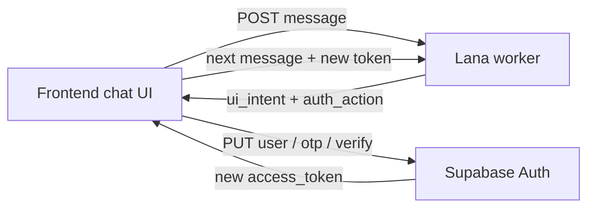

# Lana unified discovery — frontend handoff

**Audience:** mobile / PWA frontend team  
**Backend:** `tagalng-dev` · Lana worker on Cloud Run  
**Status:** v1.7 — unified chat · ranked peers · hosting/tip cards · CTA matrix · routing robustness + per-turn `debug` (June 2026)  
**Postman:** `docs/postman/TagAlng-Lana-Unified-Full-E2E.postman_collection.json`  
**Reference FE:** `apps/admin/app/lana/meet/page.tsx` + `apps/admin/lib/demo-user.ts`

One Lana chat, routed per message. This doc is the single source of truth for the response contract (`ui_intent`, `ui_actions`, `auth_action`, peer/signal payloads) and the Supabase auth handoff.

| Related doc | Use |
|-------------|-----|
| [`LANA_UNIFIED_ROUTING_FLOW.md`](./LANA_UNIFIED_ROUTING_FLOW.md) | Flow diagram + privacy rules |
| [`LANA_GUEST_SIGNUP_FRONTEND.md`](./LANA_GUEST_SIGNUP_FRONTEND.md) | Legacy guest signup (`profile_intake`) |
| [`GUEST_PWA_HANDOFF.md`](./GUEST_PWA_HANDOFF.md) | Older screen → API map |

**Base URLs (dev)**

| System | URL |
|--------|-----|
| Supabase | `https://rjlcyvwogmfmngemhbmn.supabase.co` |
| Lana worker | `https://tagalng-lana-worker-s5gmxb6whq-ue.a.run.app` |

---

## Model

Open **one chat** — send an **empty body** on session create. Backend defaults `purpose` to `"lana"` and routes **per message** (ZIP → identity → display name → preview → verify gate → full matches). Do **not** send `profile_intake` / `event_draft` for the Meet Lana experience.

When the user needs auth, Lana returns **`ui_intent`** (what input to show) and **`auth_action`** (what Supabase call to make). **Lana never verifies OTP** — the frontend calls Supabase Auth.



### What backend shipped

| Area | What shipped |
|------|--------------|
| DB migration | `20260618120000_lana_unified_purpose.sql` — adds `'lana'` to `lana_session_purpose` enum |
| Session | `POST /lana/sessions` `{}` → `purpose: "lana"`; resumes active session per user; `{ "force_new": true }` for a fresh thread |
| Discovery routing | `discovery_route.py` — ZIP → identity → display name → preview → verify gate → full. Privacy gates (ZIP/phone/OTP) stay **code-first** even when the orchestrator is on |
| `ui_intent` / `ui_actions` | Stable FE signals for input chrome + bubble CTAs (`ui_intent.py`, `ui_actions.py`) |
| Auth handoff | `auth_action` on responses — FE calls Supabase; in-chat login / logout / signup all supported |
| Profile photo | `ui_intent: upload_profile_photo` → `POST /lana/profile-photo` (file, not URL) |
| Claims | Identity lines upsert to `user_identity_claims` in the background during chat |
| Ranked peers (v1.4) | `peer_discovery_surface.py` — `match_stars`, badges, trait chips, per-card Nudge, `discovery_surface` summary |
| Hosting card (v1.5) | `hosting_surface.py` — `signal_saved.hosting` + **Open the meet up** / **Send to a mom** |
| Tip card (v1.6) | `tip_surface.py` — `signal_saved.tip` + **Pass the tip along** / **Send to a mom** |
| Routing robustness (v1.7) | `loop_guard.py` repeated-reply breaker → hands off to orchestrator; seek/offer/tip reconciliation; signal-draft pivot detection |
| `debug` (v1.7) | Optional `TurnDebug` on each response — **inbox/QA tooling only, never rendered to users** |

**Not in this slice:** mid-session host flow inside unified chat (legacy `event_draft` still works separately); backend OTP validation (by design — auth stays in Supabase).

### Prerequisites (Supabase Dashboard)

Auth → **Anonymous sign-ins**, **Manual linking**, **Phone** provider all **ON**. Dev test number (optional): `+15550999012` / OTP `000000`.

---

## API contract

### 1. Bootstrap — anonymous guest + session

```ts
const { data } = await supabase.auth.signInAnonymously(); // REST: POST /auth/v1/signup {}
const accessToken = data.session!.access_token;           // user.is_anonymous === true
```

```http
POST /lana/sessions
Authorization: Bearer <access_token>
Content-Type: application/json

{}
```

**Do not send `purpose`.** If the user already has an **active** `lana` session, the API returns that same `session_id` + the last assistant message (no new opening bubble). Pass `{ "force_new": true }` only for a deliberate blank thread (debug, post-logout). Store `session_id` — every message reuses it.

Response highlights: `session_id`, `purpose: "lana"`, `assistant_message`, `is_anonymous`, `phone_verified`, `home_block_assigned`, `routing_phase`, `ui_intent: "chat"`, `auth_action: null`, `peer_matches: []`, `activity_previews: []`.

### 2. Send messages (every turn)

```http
POST /lana/sessions/{session_id}/messages
Authorization: Bearer <access_token>
Content-Type: application/json

{ "message": "find people like me on the block" }
```

**Response fields — the canonical reference. Read every turn.**

| Field | Type | FE use |
|-------|------|--------|
| `assistant_message` | string | Render Lana bubble |
| `ui_intent` | string\|null | **Primary driver** — what input/surface to show (see table) |
| `ui_actions` | array | Bubble CTAs — render when non-empty; tap → POST `message` to Lana |
| `phone_verified` | boolean | **Source of truth** for verified state |
| `home_block_assigned` | boolean | User has `home_block_id` |
| `auth_action` | object\|null | **When set, call Supabase this same turn** (see § auth_action) |
| `peer_matches` | array | Preview or full neighbor cards (see § peer payloads) |
| `discovery_surface` | object\|null | Summary pill + weak-match metadata when peers shown |
| `activity_previews` | array | Activity browse cards |
| `pending_intros` | array | Intro inbox rows; `direction: received` rows carry per-row `actions` |
| `intro_proposal` | object\|null | Just-sent intro metadata |
| `signal_saved` | object\|null | Listening/dropped-in signal summary (may carry `hosting` or `tip`) |
| `block_log_entries` | array | Block log match cards |
| `identity_profile` | object\|null | Claims dashboard |
| `active_intent` | string\|null | Layer-1 intent — **analytics only**, pair with `ui_intent` |
| `routing_phase` | string\|null | Funnel phase — **debug only** |
| `auth_intent` / `login_phone` / `requires_login_otp` | — | Login sub-flow hints (debug) |
| `orchestrator` | boolean | Whether the AI orchestrator answered this turn |
| `debug` | object\|null | **Inbox/QA tooling only — never render to users** (see § debug) |

### 3. `ui_intent` — the FE driver

Switch UI on `ui_intent` every turn. Each row lists what to render and the bubble CTAs that may accompany it. **Render `ui_actions` only when the array is non-empty.** CTA copy/ids are in the § CTA reference.

| `ui_intent` | Render | Bubble `ui_actions` |
|-------------|--------|---------------------|
| `chat` | Default composer | — |
| `collect_zip` | ZIP field (`inputMode=numeric`, 5 digits) | — |
| `collect_identity` | Free-text "about you" | — |
| `collect_display_name` | First-name field → `users.nickname` | — |
| `collect_phone` | Phone field (`type=tel`) — send as Lana message first | — |
| `collect_otp` | OTP field (6 digits) — send as message, then run `auth_action` | — |
| `collect_signal_detail` | Composer + optional draft chips (e.g. tip asks **Where, roughly?**) | — |
| `show_peer_preview` | `peer_matches` + `discovery_surface` (per-card Nudge) | weak-match pair (when `discovery_surface.weak_peer` set) |
| `show_activity_preview` | `activity_previews` | — |
| `show_identity_profile` | `identity_profile` | — |
| `confirm_profile` | "That's me ✓" / `POST …/complete` when `ready_to_complete` | — |
| `upload_profile_photo` | **Add photo** button → file picker/camera → `POST /lana/profile-photo` | — |
| `sign_out` | Logout confirm → run `auth_action: logout` | — |
| `offer_neighbor_intro` | Match context | **Send {nick} a nudge** / **Not yet** |
| `respond_pending_intro` | Single intro waiting on user | **Yes, introduce us** / **Not now** |
| `propose_neighbor_intro` | `intro_proposal` (+ optional `pending_intros`) | **Got it** → show my intros |
| `show_pending_intros` | `pending_intros` inbox (received rows have per-row `actions`) | — |
| `show_block_log` | `block_log_entries` cards | new-match nudge **or** duplicate-intro CTA |
| `signal_saved` | `signal_saved` card | varies by `signal_saved.intent` |

### 4. `ui_actions` — shape, handling, CTA reference

Every turn may include `ui_actions: []`. When non-empty, render below the Lana bubble. **Tapping a button POSTs `action.message` to Lana — identical to typing it.**

| Field | Type | Meaning |
|-------|------|---------|
| `id` | string | Stable action id (see below) |
| `label` | string | Button copy |
| `message` | string | **POST this as the user message** on tap |
| `style` | `primary`\|`secondary`\|`ghost` | Visual weight |
| `intro_id` | string? | Target intro (accept/decline) |
| `peer_user_id` | string? | Target neighbor (nudge) |

```ts
async function onUiAction(action: LanaUiAction) {
  await sendMessage(token, sessionId, action.message);
}
```

**Bubble CTAs by scenario** (the one place these are defined):

| Scenario | `id` | Label | `message` | `style` |
|----------|------|-------|-----------|---------|
| Peer weak-match (`show_peer_preview`) | `peer_wait_stronger` | Wait for stronger | `wait for stronger matches` | secondary |
| | `peer_nudge_weak` | Nudge {nick} anyway | `introduce me to {nickname}` | primary |
| Intro offer (`offer_neighbor_intro`) | `intro_propose` | Send {nick} a nudge | `introduce me to {nick}` | primary |
| | `intro_pass` | Not yet | `not now` | secondary |
| Intro respond (`respond_pending_intro`) | `intro_accept` | Yes, introduce us | `yes introduce us` | primary |
| | `intro_decline` | Not now | `not now` | secondary |
| Intro just sent (`propose_neighbor_intro`) | `intro_sent_ack` | Got it | `show my intros` | primary |
| Block log — new match (`show_block_log`) | `block_log_nudge` | Introduce me to #1 / Send {nick} a nudge | `introduce me to #1` / `introduce me to {nick}` | primary |
| | `block_log_pass` | Not now | `maybe later` | secondary |
| Block log — duplicate intro (`show_block_log` + `recent_intro_duplicate`) | `intro_show_inbox` | Show my intros | `show my intros` | primary |
| | `intro_pass` | Not yet | `not now` | secondary |
| Signal — swap/meet/tip **seek** (`signal_saved`, intent ≠ host/tip_share) | `signal_show_block_log` | Show my block log | `show my block log` | primary |
| | `signal_wait` | Not yet | `maybe later` | secondary |
| Signal — `host_meet` (not yet opened) | `hosting_open` | Open the meet up | `open the meet up` | primary |
| | `hosting_send` | Send to a mom | `send to a mom` | secondary |
| Signal — `tip_share` (not yet passed) | `tip_pass` | Pass the tip along | `pass the tip along` | primary |
| | `tip_send_mom` | Send to a mom | `send to a mom` | secondary |

Once `host_meet` is opened, `hosting_opened: true` and `ui_actions` is empty.

**Per-card `actions`** (on `peer_matches[]` and `pending_intros[]`, not bubble-level — same tap contract):

| Surface | `id` | Label | `message` |
|---------|------|-------|-----------|
| `peer_matches[]` (ranked) | `peer_card_nudge` | Nudge | `introduce me to {nickname}` |
| `pending_intros[]` (`received`, `proposed`) | `intro_accept` | Yes, introduce us | `yes introduce us` |
| | `intro_decline` | Not now | `not now` |

**Don't confuse:**

| User goal | Correct CTA | Wrong CTA |
|-----------|-------------|-----------|
| Posted swap/meet/tip **seek** | **Show my block log** | Show my intros |
| Already **sent** an intro | **Show my intros** | Send another nudge |
| **Block log** row — first nudge | **Introduce me to #1** | Show my intros |

**Turn-scoped payloads** (cleared each turn unless re-stamped — never let stale values drive buttons): `signal_saved`, `block_log_entries`, `identity_profile`, `pending_intros`, `recent_intro_duplicate`.

TS types: `apps/admin/lib/lana-client.ts` → `LanaUiIntent`, `LanaUiAction`, `AuthActionPayload`.

### 5. `debug` — inbox/QA only (never render to users)

Optional `TurnDebug` explaining why the turn routed as it did. All fields nullable.

```json
{
  "debug": {
    "intent": "looking.tip", "goal": "save_signal", "confidence": 0.82,
    "signal_intent": "tip_seek", "active_intent": "looking.tip",
    "routing_phase": "preview", "ui_intent": "signal_saved",
    "handler": "save_local_signal", "orchestrator": false,
    "slots": { "linear_intent": "looking.tip", "goal": "save_signal" }
  }
}
```

`intent`/`goal`/`confidence`/`signal_intent` = Layer-1 slot read · `active_intent`/`routing_phase`/`ui_intent` mirror top-level · `handler` = tool that replied · `orchestrator` = whether the LLM answered (e.g. after the loop guard tripped) · `slots` = sanitized slot dump.

> **Analytics-only fields:** `active_intent` (e.g. `discovery.find_peers`, `social.propose_intro`, `looking.swap`), `routing_phase` (`listening`, `need_zip`, `need_identity`, `need_display_name`, `preview`, `await_signup_phone`/`await_signup_otp`, `await_login_phone`/`await_login_otp`, `await_profile_photo`, `await_logout`). Drive UI from `ui_intent`, not these.

---

## Peer discovery payloads

### Preview vs full `peer_matches`

**Preview** (anonymous/unverified) — label only, **no names/IDs/avatars/scores/actions**:

```json
{ "peer_user_id": null, "nickname": null, "avatar_url": null,
  "similarity_score": null, "matching_peer_label": "Mom of toddlers", "preview": true }
```

**Full** (only when `phone_verified: true` + block context) — enrichment fields below are optional; legacy clients can render `matching_peer_label` + `%`:

```json
{
  "peer_user_id": "uuid", "nickname": "Kashaf", "avatar_url": "https://...",
  "similarity_score": 0.88, "matching_peer_label": "American mom · Weekend hikes",
  "preview": false,
  "match_stars": 5, "match_band": "strong", "match_badge": "PERFECT FIT",
  "trait_tags": ["American mom", "Weekend hikes"],
  "actions": [{ "id": "peer_card_nudge", "label": "Nudge",
               "message": "introduce me to Kashaf", "style": "primary", "peer_user_id": "uuid" }]
}
```

`match_stars` 1–5 (prefer over raw %) · `match_badge` ∈ `PERFECT FIT`/`STRONG`/`PARTIAL`/`WEAK` · `trait_tags` short chips · `actions` per-card Nudge.

`discovery_surface` (top-level, when peers shown):

```json
{ "strong_count": 2, "partial_count": 1, "weak_count": 1,
  "status_label": "2 strong fits · 1 partial",
  "weak_peer": { "peer_user_id": "uuid", "nickname": "Helena", "match_stars": 2, "match_badge": "WEAK" },
  "ranked_summary": "KASHAF 5/5 · ADA 4/5" }
```

Render `status_label` as a pill above Lana. When `weak_peer` is set (mixed strong/partial + weak), show the weak-match CTA pair. Omitted entirely for preview rows.

### Hosting card — `signal_saved.hosting` (`intent === "host_meet"`)

```json
{ "signal_saved": {
    "intent": "host_meet", "detail_text": "Brazilian coffee Saturday at Foxtail", "matches_created": 3,
    "hosting": { "title": "Brazilian coffee", "headline": "Heard you — Brazilian coffee.",
      "when_label": "Saturday morning", "where_label": "Foxtail · Lake Nona",
      "who_label": "Neighbors on your block",
      "trait_tags": ["Brazilian coffee", "Saturday morning", "Foxtail · Lake Nona"],
      "status_label": "Ready to open it up", "outreach_copy": "I'll text the 3 closest fits on your block." } },
  "ui_intent": "signal_saved" }
```

Render WHEN/WHERE/WHO + trait chips + `status_label`. CTAs: **Open the meet up** / **Send to a mom**. After open: `hosting_opened: true`, hide CTAs.

### Tip card — `signal_saved.tip` (`intent === "tip_share"`)

```json
{ "signal_saved": {
    "intent": "tip_share", "category": "health", "detail_text": "Dr. Smith · doctor",
    "tip": { "title": "Dr. Smith · doctor", "headline": "Heard you — Dr. Smith · doctor.",
      "where_label": "Lake Nona", "trait_tags": ["gentle", "takes insurance"],
      "status_label": "Ready to pass it along", "outreach_copy": "I'll listen for moms who need this." } },
  "ui_intent": "signal_saved" }
```

Render title + trait chips + WHERE (when known). CTAs: **Pass the tip along** / **Send to a mom**. `collect_signal_detail` may precede the save (Lana asks **Where, roughly?**).

> **Seeks vs shares:** swap/meet/tip **seek** uses the plain `signal_saved` card + **Show my block log** / **Not yet**. Only `host_meet` → hosting card, only `tip_share` → tip card. `signal_saved.intent` ∈ `swap_seek`, `swap_offer`, `meet_seek`, `host_meet`, `tip_seek`, `tip_share`.

---

## `auth_action` — frontend responsibility

> **Lana never verifies OTP.** It parses phone/OTP from chat and returns `auth_action` telling FE which Supabase call to make. Verification is real **only after Supabase returns 200**.

Shape: `{ "type": "verify_signup_otp", "phone": "+1...", "token": "000000", "verify_type": "phone_change" }`.

| `auth_action.type` | When | Supabase call (bearer) |
|--------------------|------|------------------------|
| `link_phone_signup` | Phone given during signup/discovery | `PUT /auth/v1/user` (**guest access_token**) |
| `verify_signup_otp` | OTP given (signup) | `POST /auth/v1/verify` `type: phone_change` (**anon key**) |
| `send_login_otp` | "log in" + phone | `POST /auth/v1/otp` `create_user: false` (**anon key**) |
| `verify_login_otp` | OTP given (login) | `POST /auth/v1/verify` `type: sms` (**anon key**) |
| `logout` | Signed-in user said "log out" | `signOut()` / `POST /auth/v1/logout`, then fresh anon session |

**OTP `type` — do not mix:** signup/discovery uses **`phone_change`** (keeps the **same `user_id`** as the Lana session); returning login uses **`sms`** (different `user_id`). Using `sms` during signup creates a different user → Lana returns `session_not_found`.

### Handling every turn

```ts
const turn = await sendMessage(token, sessionId, text);
applyTurn(turn); // ui_intent, peer_matches, etc.
const action = authActionFromTurn(turn);
if (action) {
  const newToken = await handleLanaAuthAction(action);
  // signup: same session_id, new token → send "ok"
  // login/logout: new user_id → start a NEW Lana session
}
```

> On the verify-gate turn (`collect_phone`, `auth_action: null`), **Send code** must **POST the phone to Lana first** — Lana then replies `collect_otp` + `auth_action.type: link_phone_signup`, and only **then** do you run the Supabase PUT. Don't call `PUT /auth/v1/user` before `auth_action` exists.

`authActionFromTurn` fallback (login OTP can be inferred — see `demo-user.ts`):

```ts
function authActionFromTurn(turn) {
  if (turn.auth_action?.type) return turn.auth_action;
  if (turn.login_otp_token && turn.login_phone)
    return { type: 'verify_login_otp', phone: turn.login_phone, token: turn.login_otp_token, verify_type: 'sms' };
  if (turn.requires_login_otp && turn.login_phone)
    return { type: 'send_login_otp', phone: turn.login_phone, verify_type: 'sms' };
  return null;
}
```

### Signup (discovery) — same `user_id`, same `session_id`

User chats phone + OTP (or uses the `collect_phone`/`collect_otp` fields). All HTTP below uses `apikey: <anon_key>`.

```http
PUT /auth/v1/user            POST /auth/v1/verify
Authorization: Bearer <guest access_token>   (no user bearer needed; anon key)
{ "phone": "+15550999012" }  { "phone": "+15550999012", "token": "000000", "type": "phone_change" }
```

`verify` returns a new `access_token` with the **same `user_id`**. Use it for all further Lana calls on the **same `session_id`**; send `"ok"` to resume → `phone_verified: true` + full matches. Refresh the anon JWT before `PUT /user` if idle > 1h (`refreshSession()`).

```ts
if (action.type === 'verify_signup_otp') {
  const newToken = await handleLanaAuthAction(action); // POST /verify phone_change
  return await sendMessage(newToken, sessionId, 'ok'); // SAME session_id, NEW bearer
}
```

### Login (returning user) — new `user_id`, new Lana session

User says "log in": `await_login_phone` → `await_login_otp` (`collect_phone` → `collect_otp`).

```http
POST /auth/v1/otp                      POST /auth/v1/verify
{ "phone": "+1...", "create_user": false }   { "phone": "+1...", "token": "000000", "type": "sms" }
```

`setSession` with returned tokens → **new `user_id`**. Abandon the guest `session_id`; call `POST /lana/sessions` again with the login token.

> **Do not** use `signInWithOtp` while an anonymous Lana session is in storage — it overwrites the guest session. Use raw `POST /auth/v1/otp`.

### Logout (signed-in user) — new anonymous session

User says "log out". Lana sets `auth_action: { type: "logout" }`, `ui_intent: "sign_out"`, `routing_phase: "await_logout"` (all aligned on the turn).

```ts
if (turn.ui_intent === 'sign_out' || action?.type === 'logout') {
  await supabase.auth.signOut();
  const { data } = await supabase.auth.signInAnonymously();
  const anonToken = data.session!.access_token;
  const lana = await lanaFetch('/lana/sessions', anonToken, {
    method: 'POST', body: JSON.stringify({ force_new: true }), // don't resume the old thread
  });
  setSessionId(lana.session_id); setAccessToken(anonToken);
  // reset peer_matches, phone_verified, signed-in profile UI
}
```

**Edge cases:** not signed in → Lana says nothing to log out of (no `auth_action`). Already signed in + "log in" → Lana says you're already in (no `auth_action`). Non-phone reply during login ("no thanks", "build my profile") exits login → `ui_intent: chat`.

### Confirming verification really succeeded

```ts
const { data: { user } } = await supabase.auth.getUser();
// user.is_anonymous === false && user.phone_confirmed_at !== null
```

The **next** Lana response shows `phone_verified: true`. Lana's "Perfect — verifying you now…" bubble is **not** verification; `phone_verified: false` there means auth has not completed. Wrong OTP → Supabase 400, `phone_verified` stays `false`.

### Profile photo — file upload, not a URL

When `ui_intent: upload_profile_photo` (user asks to add/change a picture, says "yes" to a suggestion, or is in `await_profile_photo`), show a file/camera picker:

```http
POST /lana/profile-photo
Authorization: Bearer <access_token>
Content-Type: multipart/form-data

file=<image/jpeg|png|webp, max 2MB>
```

→ `{ "profile_photo_url": "https://<project>.supabase.co/storage/v1/object/public/avatars/<user_id>/avatar.jpg" }`. Backend upserts to bucket `avatars` at `{user_id}/avatar.{ext}` and sets `users.profile_photo_url`. After upload, send `"done"` so Lana confirms. Guest without a verified phone → Lana asks to verify first (no `upload_profile_photo`). "no thanks"/"skip" → back to `chat`.

### Profile / claims during chat

Display name → `users.nickname` (sync on "my name is …" or the name gate). Identity threads → `user_identity_claims` (background upsert per message). Full extract + embeddings → `POST /lana/sessions/{id}/complete` (optional; `ready_to_complete` / "That's me ✓").

---

## Discovery happy path

| # | User message | `ui_intent` after | Notes |
|---|--------------|-------------------|-------|
| 1 | *(session open)* | `chat` | Greeting |
| 2 | `find people like me on the block` | `collect_zip` | `active_intent: discovery.find_peers` |
| 3 | `32827` | `collect_identity` | `get_blocks_near_zip` → `preview_block_id` |
| 4 | `I'm a Latino mom…` | `collect_display_name` | if `nickname` empty |
| 5 | `Marina` | `show_peer_preview` | 3 redacted `peer_matches` |
| 6 | `show me their names` | `collect_phone` | verify gate (triggers: names, introduce, connect, full, meet them) |
| 7 | `+15550999012` | `collect_otp` | `auth_action: link_phone_signup` → FE **PUT /user** |
| 8 | `000000` | `collect_otp` | `auth_action: verify_signup_otp` → FE **POST /verify** `phone_change` |
| 9 | `ok` *(new bearer)* | `show_peer_preview` / full | `phone_verified: true` → full matches |

Logged-in users (`phone_verified: true`) skip the verify ask; full matches once `home_block_id` is set.

**Postman REST sequence:** steps 1–8 are Lana-only (collection ends at `auth_action`). Add the Supabase **PUT /user** (step 7) and **POST /verify** `phone_change` (step 8) manually — copy from `TagAlng-Guest-Onboarding-Full` "Phase 2 — Phone verify" — then resume Lana with the new bearer.

---

## Frontend checklist

- [ ] `POST /auth/v1/signup` `{}` on entry → `POST /lana/sessions` `{}` (no `purpose`); reuse `session_id`
- [ ] Read **`ui_intent`** every turn to switch phone/OTP/ZIP/name/photo inputs
- [ ] Read `auth_action` (or `authActionFromTurn`) on the same turn as a phone/OTP message
- [ ] **Signup:** PUT /user → POST /verify `phone_change` → same `session_id` + `ok`
- [ ] **Login:** POST /otp → POST /verify `sms` → **new** `POST /lana/sessions`
- [ ] **Logout:** `sign_out` / `auth_action: logout` → `signOut()` → anon signup → `POST /lana/sessions` `{ force_new: true }`
- [ ] Never use `signInWithOtp` during an active anonymous Lana session
- [ ] Render `peer_matches` / `activity_previews`, respecting `preview: true` (hide names/avatars)
- [ ] Ranked peers: `match_stars`/`match_badge`/`trait_tags`, per-card `actions`, `discovery_surface.status_label` pill, weak-match CTAs when `weak_peer` set
- [ ] Hosting card (`signal_saved.hosting`) + tip card (`signal_saved.tip`); seek saves → **Show my block log**
- [ ] Duplicate intro → **Show my intros** (not another nudge)
- [ ] Render `ui_actions` only when non-empty; tap → `sendMessage(action.message)`; respect turn-scoped clearing
- [ ] Gate connect CTAs on `phone_verified === true`
- [ ] Ignore `debug` in user-facing UI (admin/QA only)
- [ ] Fresh test phone per signup run

---

## Reference

**Legacy purposes (still work, not for new FE):** `profile_intake` (old onboarding), `event_draft` (host draft — separate flow). Unified `lana` will add host routing later.

**Postman / testing:** `docs/postman/TagAlng-Lana-Unified-Discovery.postman_collection.json`, `…-Full-E2E…`, `TagAlng-Guest-InChat-Login…`; env `TagAlng-tagalng-dev` (set `anon_key`, fresh `test_phone`/`test_otp` per run).

**Troubleshooting:**

| Symptom | Cause → Fix |
|---------|-------------|
| `invalid input value for enum lana_session_purpose: "lana"` | Migration not applied (`20260618120000`) — fixed on dev |
| `phone_verified: false` after OTP | FE skipped Supabase verify → `POST /verify`, then send Lana message with new token |
| `Token has expired or is invalid` on verify | Stale anon JWT / reused phone → `refreshSession()` before PUT, fresh test phone |
| `session_not_found` after OTP | Used `type: sms` on signup → use `phone_change` |
| Login OTP never arrives | `signInWithOtp` clobbered guest session → raw `POST /auth/v1/otp` |
| Preview peers but no names | Expected before verify → verify, then send another message |
| Real (non-test) phone | Use the SMS code, not `000000` |

**Repo files:**

| File | Purpose |
|------|---------|
| `apps/admin/lib/demo-user.ts` | Supabase REST auth — signup/login/logout handlers |
| `apps/admin/lib/lana-client.ts` | Lana client + `LanaUiIntent` / `AuthActionPayload` types + `uploadProfilePhoto` |
| `apps/admin/app/lana/meet/page.tsx` | Chat UI + phone/OTP fields + `pushTurn` |
| `services/lana-worker/app/models.py` | `SendMessageResponse` + `TurnDebug` |
| `services/lana-worker/app/discovery_route.py` | Discovery + auth phases |
| `services/lana-worker/app/ui_intent.py` / `ui_actions.py` | `ui_intent` + CTA derivation |
| `services/lana-worker/app/peer_discovery_surface.py` | Ranked peer cards + `discovery_surface` |
| `services/lana-worker/app/hosting_surface.py` / `tip_surface.py` | Hosting + tip card payloads |
| `services/lana-worker/app/loop_guard.py` | v1.7 repeated-reply loop breaker |
| `services/lana-worker/app/turn_surfaces.py` | Turn-scoped payload clearing |
| `services/lana-worker/app/profile_photo.py` | Profile photo intent + storage upload |
| `tagalng-pwa-main/src/lib/lana.ts` | PWA types — `LanaUiIntent`, `LanaUiAction`, `SignalSaved`, `TipDraft` |

**Open questions for backend:** host flow inside unified `lana` not yet routed (use `event_draft` temporarily); `complete` is optional for discovery (incremental claims already save).