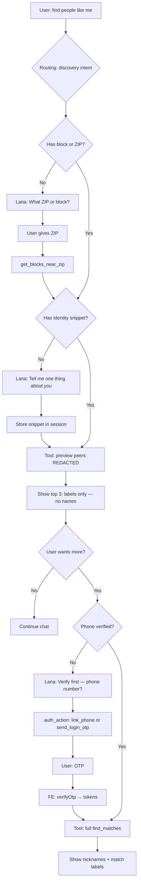

# Lana unified routing — discovery + auth gates

**Audience:** product, frontend, backend  
**Status:** v1 vertical slice (find similar users)  
**Code:** `services/lana-worker/app/lana_dispatch.py` · `discovery_route.py`

---

## TL;DR

Frontend opens **one chat** — no `profile_intake` / `event_draft` mode. Backend **routing rules** decide each turn: missing slots → ask → call API at the right **privacy level** → gate verify when user wants more.

```http
POST /lana/sessions          {} 
POST /lana/sessions/{id}/messages   { "message": "..." }
```

---

## Flow diagram — “find similar users”



---

## Routing outcomes (Tool Routing v1 aligned)

| Outcome | When | Example |
|---------|------|---------|
| **A · Ask** | Intent clear, slot missing | “What ZIP are you on?” |
| **T · Tool** | Slots + rules OK | `preview_peers_on_block` / `match_peers_by_claim_vectors` |
| **G · Gate** | Action needs verify | “To connect you, verify your phone first” |
| **R · Respond** | Companionship / ack | “Got it.” |

---

## Privacy rules (preview vs full)

| Auth state | Block known | Claims | API | User sees |
|------------|-------------|--------|-----|-----------|
| Anonymous | yes | optional snippet | preview | “3 neighbors · shared: moms, weekend activities” — **no names/IDs** |
| Anonymous | yes | yes (session) | preview+ | Better labels, still redacted |
| Verified | yes | DB claims | full | Nicknames, scores, intro CTA |
| Any | no | — | none | Ask ZIP first |

**“More” triggers verify:** names, introduce, connect, show users, full details.

---

## Auth actions (frontend)

Response field `auth_action` tells FE when to call Supabase (Lana does not mint JWTs).

| `auth_action.type` | Supabase call | `verify_type` |
|--------------------|---------------|---------------|
| `send_login_otp` | `signInWithOtp({ phone })` | — |
| `verify_login_otp` | `verifyOtp({ phone, token, type: 'sms' })` | `sms` |
| `link_phone_signup` | `updateUser({ phone })` | — |
| `verify_signup_otp` | `verifyOtp({ phone, token, type: 'phone_change' })` | `phone_change` |

After `verify_*`, FE refreshes session token and sends next message with new bearer.

---

## Session context (backend-internal)

Stored in `lana_sessions.context` — FE optional read via `GET /lana/sessions/{id}`.

| Key | Meaning |
|-----|---------|
| `unified_mode` | `true` for purpose `lana` |
| `active_intent` | e.g. `discovery.find_peers` |
| `routing_phase` | `need_zip` · `need_identity` · `preview` · `gate_verify` · `await_signup_phone` · `await_signup_otp` |
| `preview_block_id` | Block from ZIP (not yet assigned to user) |
| `preview_zip` | ZIP string |
| `identity_snippet` | User-described identity for matching |

Legacy `guest_step` / `profile_intake` still work when `purpose` is set explicitly (deprecated).

---

## API response shape (unified turn)

```json
{
  "assistant_message": "I found 3 neighbors on your block…",
  "peer_matches": [
    {
      "nickname": null,
      "matching_peer_label": "Weekend activities",
      "similarity_score": null,
      "preview": true
    }
  ],
  "auth_action": null,
  "routing": {
    "outcome": "T",
    "intent_class": "discovery",
    "tool_called": "preview_peers_on_block"
  },
  "active_intent": "discovery.find_peers",
  "routing_phase": "preview"
}
```

---

## Postman

- **`TagAlng-Lana-Unified-Discovery.postman_collection.json`** — steps 1–8 (anonymous → ZIP → identity → preview → verify gate)
- `TagAlng-Guest-InChat-Login` — in-chat login
- Legacy: `TagAlng-Guest-Onboarding-Full` (`profile_intake` purpose)

**Frontend integration:** [`LANA_UNIFIED_DISCOVERY_FRONTEND.md`](./LANA_UNIFIED_DISCOVERY_FRONTEND.md) — full handoff including Supabase verify steps 9–11.

---

## Related specs

- [`LANA_AGENT_ARCHITECTURE_v1.md`](./LANA_AGENT_ARCHITECTURE_v1.md) — orchestrator target
- [`LANA_TOOL_ROUTING_v1.md`](./LANA_TOOL_ROUTING_v1.md) — R/A/T/C outcomes
- [`LANA_GUEST_SIGNUP_FRONTEND.md`](./LANA_GUEST_SIGNUP_FRONTEND.md) — OTP types
